# DBProject_214485302_332382159

## Cover Page

**Submitted by:** 214485302, 332382159

**System:** Hospital Management System

**Selected Unit:** Medical Staff, Patients, and Treatments Management

---

## Table of Contents

1. [Introduction](#introduction)
2. [System Design](#system-design)
3. [ERD Diagram](#erd-diagram)
4. [DSD Diagram](#dsd-diagram)
5. [Design Decisions](#design-decisions)
6. [Data Insertion](#data-insertion)
7. [Backup and Restore](#backup-and-restore)

---

## Introduction

The system is designed for hospital management and enables tracking of medical staff, patients, treatments, and medications.

**Data stored in the system:**
- **Person** — Basic details of every individual in the system (name, phone number)
- **Medical Staff** — Medical employees including salary, email, and hire date
- **Patient** — Hospital patients with birth date and blood type
- **Attending Doctor** — Doctors assigned to departments
- **Nurse** — Nurses with specialization and shift type
- **Researcher** — Researchers working in laboratories
- **Department** — Hospital departments with number of beds
- **Lab** — Research laboratories with number of technicians
- **Medication** — Medication catalog with prices
- **Shift** — Staff shifts with start and end times
- **Treatment** — Treatments given to patients by doctors
- **Medications Given** — Link between treatments and medications administered

**Main functionality:**
- Managing and tracking medical staff (doctors, nurses, researchers)
- Assigning staff to departments and laboratories
- Shift management
- Tracking treatments and medications given to patients
- Department and laboratory management

---

## System Design

---

## ERD Diagram

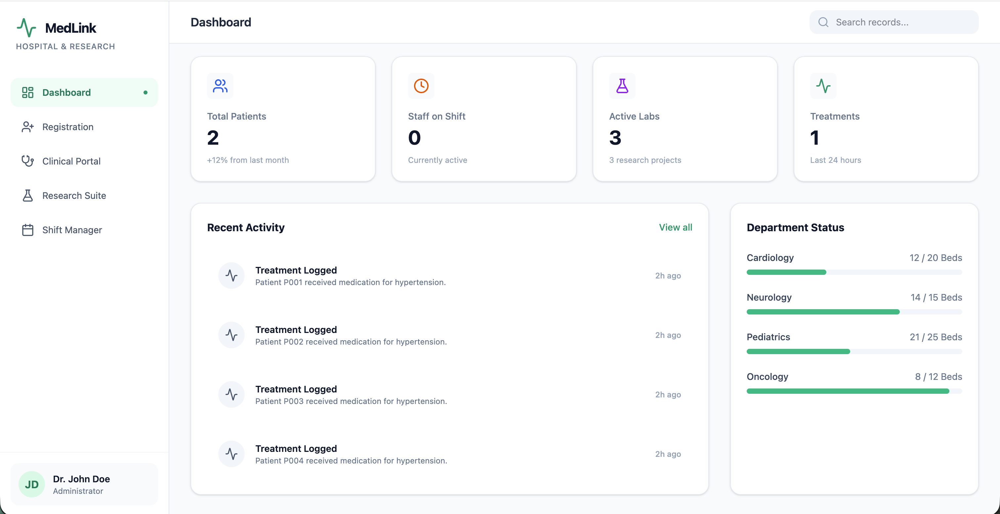

---

## DSD Diagram

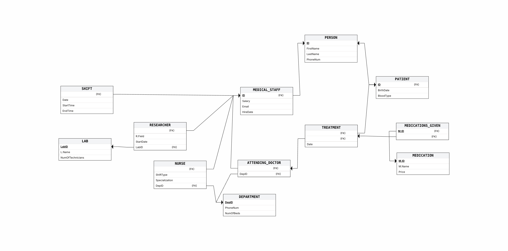

---

## Design Decisions

1. **Inheritance (ISA):** The `Person` entity serves as the supertype. `Medical_Staff` and `Patient` inherit from it. Within `Medical_Staff` there are three subtypes: `Attending_Doctor`, `Nurse`, and `Researcher`. Inheritance is implemented using a foreign key that is also a primary key (ID) — so every record in `Medical_Staff` must first exist in `Person`.

2. **Meaningful DATE fields:**
   - `HireDate` in `MEDICAL_STAFF` — Employee hire date
   - `BirthDate` in `PATIENT` — Patient birth date
   - `Treatment_Date` in `TREATMENT` — Treatment date
   - `StartDate` in `RESEARCHER` — Research start date
   - `Shift_Date` in `SHIFT` — Shift date

3. **Constraints:**
   - `Salary > 0` — Salary must be positive
   - `Price >= 0` — Medication price cannot be negative
   - `NumOfBeds >= 0` — Number of beds cannot be negative
   - `NumOfTechnicians >= 0` — Number of technicians cannot be negative
   - `BloodType IN ('A+','A-','B+','B-','AB+','AB-','O+','O-')` — Only valid blood type values
   - `Email UNIQUE` — Unique email address per employee

4. **Relationships:**
   - `Treatment` — Many-to-many relationship between `Patient` and `Attending_Doctor` with date as part of the key
   - `Medications_Given` — Many-to-many relationship between `Treatment` and `Medication`
   - `Shift` — Weak entity dependent on `Medical_Staff`

---

## Data Insertion

Data was inserted using 3 different methods:

### Method 1: CSV File Import (`DataImportFiles/`)

CSV files were generated using a Python script (`generate_csv.py`).

**Tables:**
| Table | Record Count |
|-------|-------------|
| PERSON | 21,500 |
| PATIENT | 20,000 |

Data was imported into the database using SQL*Loader with control files (`.ctl`).

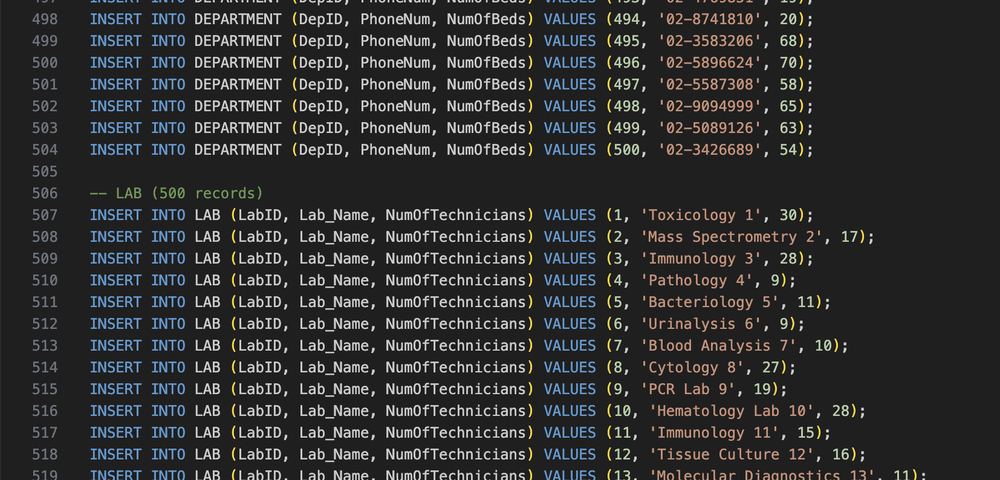

### Method 2: Programming — Python-generated INSERT statements (`Programing/`)

A Python script (`generate_inserts.py`) generates a SQL file with INSERT statements.

**Tables:**
| Table | Record Count |
|-------|-------------|
| MEDICAL_STAFF | 1,500 |
| ATTENDING_DOCTOR | 500 |
| NURSE | 500 |
| RESEARCHER | 500 |
| SHIFT | 500 |
| TREATMENT | 20,000 |
| MEDICATIONS_GIVEN | 500 |

### Method 3: generatedata — INSERT statement generation (`generatedataFiles/`)

INSERT statements were generated for the following tables:

**Tables:**
| Table | Record Count |
|-------|-------------|
| DEPARTMENT | 500 |
| LAB | 500 |
| MEDICATION | 500 |

### Record Count Summary

| Table | Record Count | Method |
|-------|-------------|--------|
| PERSON | 21,500 | CSV Import |
| PATIENT | 20,000 | CSV Import |
| TREATMENT | 20,000 | Python INSERT |
| MEDICAL_STAFF | 1,500 | Python INSERT |
| DEPARTMENT | 500 | generatedata |
| LAB | 500 | generatedata |
| MEDICATION | 500 | generatedata |
| ATTENDING_DOCTOR | 500 | Python INSERT |
| NURSE | 500 | Python INSERT |
| RESEARCHER | 500 | Python INSERT |
| SHIFT | 500 | Python INSERT |
| MEDICATIONS_GIVEN | 500 | Python INSERT |

---

## Backup and Restore

### Backup

Backup was performed using Oracle Data Pump Export (`expdp`).

Backup file is saved in the format: `backup_YYYY-MM-DD.dmp`

Backup script: `backup.bat`

### Restore

Restore was performed on a different machine using Oracle Data Pump Import (`impdp`).

Restore script: `restore.bat`

🔍 Section 1: Comparative SELECT Queries (Double Versions)
In this section, four logic scenarios are implemented using two different SQL approaches to compare efficiency.

1. Doctor Efficiency Ranking
תיאור השאילתא: דירוג כלכליות רופאים - חישוב מדד רווחיות המבוסס על כמות הטיפולים ביחס לשכר הרופא.

Version A:

SQL
SELECT 
    p.FirstName || ' ' || p.LastName as Doctor_Name,
    COUNT(t.Treatment_Date) as Total_Treatments,
    ms.Salary,
    (NULLIF(ms.Salary, 0) / COUNT(t.Treatment_Date)) as Profitability_Index
FROM PERSON p
JOIN MEDICAL_STAFF ms ON p.ID = ms.ID
JOIN ATTENDING_DOCTOR ad ON ms.ID = ad.Doctor_ID
LEFT JOIN TREATMENT t ON ad.Doctor_ID = t.Doctor_ID
GROUP BY p.ID, p.FirstName, p.LastName, ms.Salary
ORDER BY Profitability_Index DESC
LIMIT 50;
Version B (Place for your second version):
(Insert your second version here)

Screenshots:

Query Result:
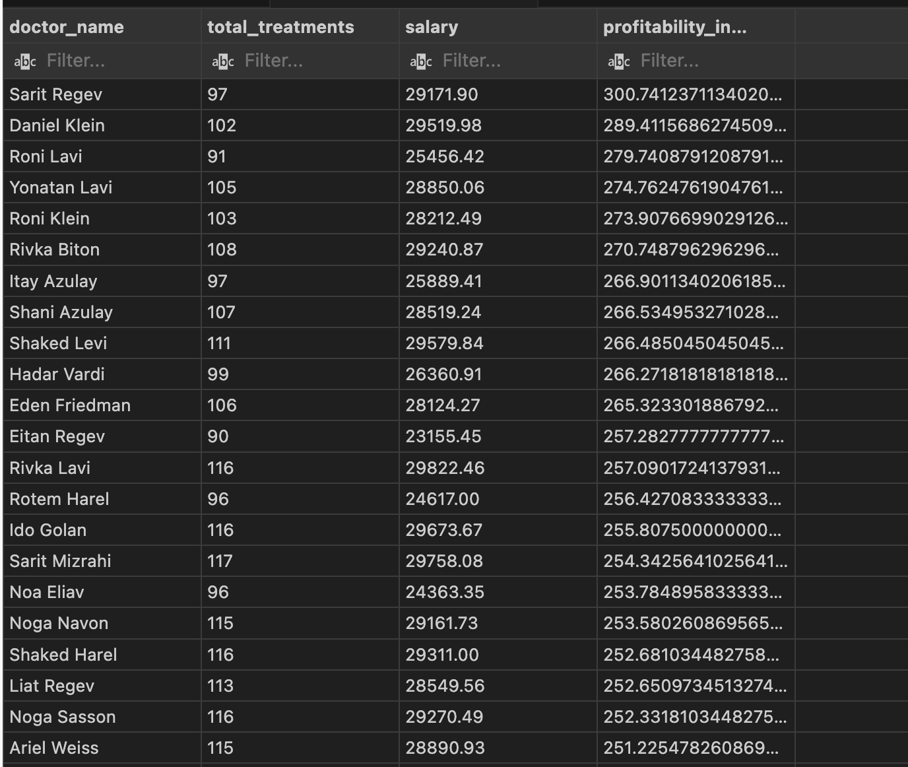

Comparison & Efficiency:
(Insert here the explanation of which version is more efficient and why - e.g., usage of JOINs vs. Subqueries)

2. Local On-Call Doctors
תיאור השאילתא: מציאת רופאים כוננים שגרים באותה עיר של החולים שטיפלו בהם ב-24 השעות האחרונות (לצרכי קרבה גאוגרפית).

Version A (EXISTS):

SQL
SELECT p_staff.FirstName, p_staff.LastName, p_staff.City
FROM PERSON p_staff
WHERE EXISTS (
    SELECT 1 FROM TREATMENT t
    JOIN PERSON p_pat ON t.Patient_ID = p_pat.ID
    WHERE t.Doctor_ID = p_staff.ID
    AND p_pat.City = p_staff.City
    AND t.Treatment_Date >= CURRENT_DATE - INTERVAL '1 day'
);
Version B (Place for your second version):
(Insert your second version here)

Screenshots:

Query Result: 
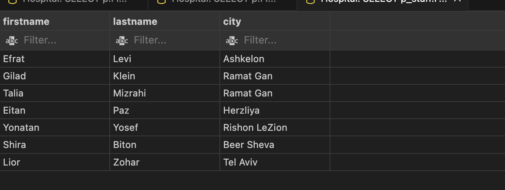

Comparison & Efficiency:
(Explanation here)

3. Available Beds with Staffing Check
תיאור השאילתא: ניהול תפוסת מחלקות בזמן אמת - חישוב מיטות פנויות על סמך טיפולים שבוצעו בשבוע האחרון.

Version A:

SQL
SELECT 
    d.DepID,
    d.NumOfBeds as Total_Capacity,
    COUNT(DISTINCT t.Patient_ID) as Occupied_Beds,
    (d.NumOfBeds - COUNT(DISTINCT t.Patient_ID)) as Available_Beds
FROM DEPARTMENT d
LEFT JOIN ATTENDING_DOCTOR ad ON d.DepID = ad.DepID
LEFT JOIN TREATMENT t ON ad.Doctor_ID = t.Doctor_ID 
    AND t.Treatment_Date >= NOW() - INTERVAL '1 week'
GROUP BY d.DepID, d.NumOfBeds
ORDER BY Available_Beds DESC;
Version B (Place for your second version):
(Insert your second version here)

Screenshots:

Query Result:
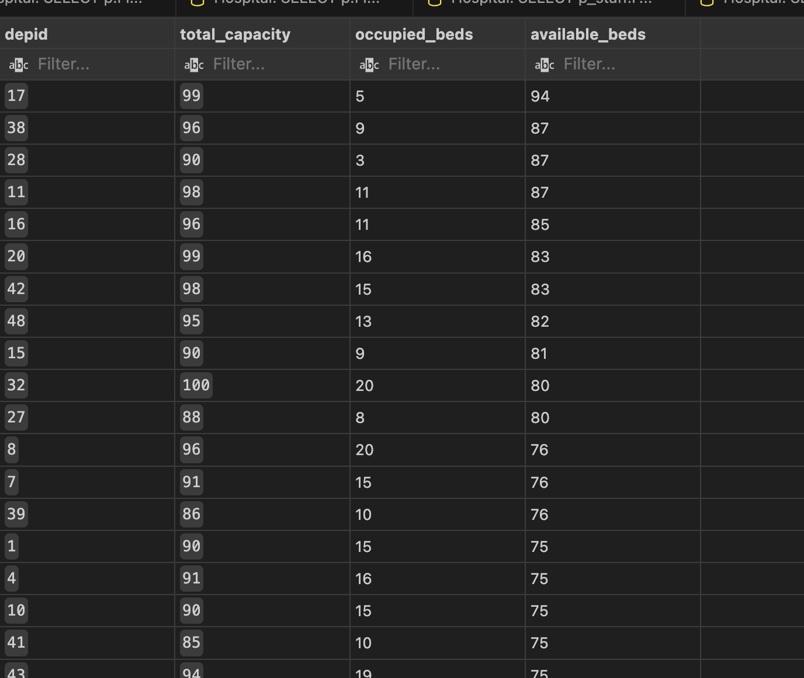

Comparison & Efficiency:
(Explanation here)

4. Monthly Outbreak Alert
תיאור השאילתא: התראת עלייה בתחלואה - זיהוי החודש שבו הייתה התחלואה הגבוהה ביותר בכל עיר ביחס לממוצע השנתי.

Version A (Window Functions):

SQL
SELECT City, Monthly_Count, Yearly_Avg_Integer
FROM (
    SELECT 
        City, 
        Monthly_Count, 
        CAST(Yearly_Avg AS INT) as Yearly_Avg_Integer,
        ROW_NUMBER() OVER(PARTITION BY City ORDER BY Monthly_Count DESC) as rank_per_city
    FROM (
        SELECT 
            p.City,
            COUNT(*) OVER(PARTITION BY p.City, EXTRACT(MONTH FROM t.Treatment_Date)) as Monthly_Count,
            COUNT(*) OVER(PARTITION BY p.City) / 12.0 as Yearly_Avg
        FROM PERSON p
        JOIN TREATMENT t ON p.ID = t.Patient_ID
    ) Stats
    WHERE Monthly_Count > Yearly_Avg
) RankedStats
WHERE rank_per_city = 1
ORDER BY Monthly_Count DESC;
Version B (Place for your second version):
(Insert your second version here)

Screenshots:

Query Result:
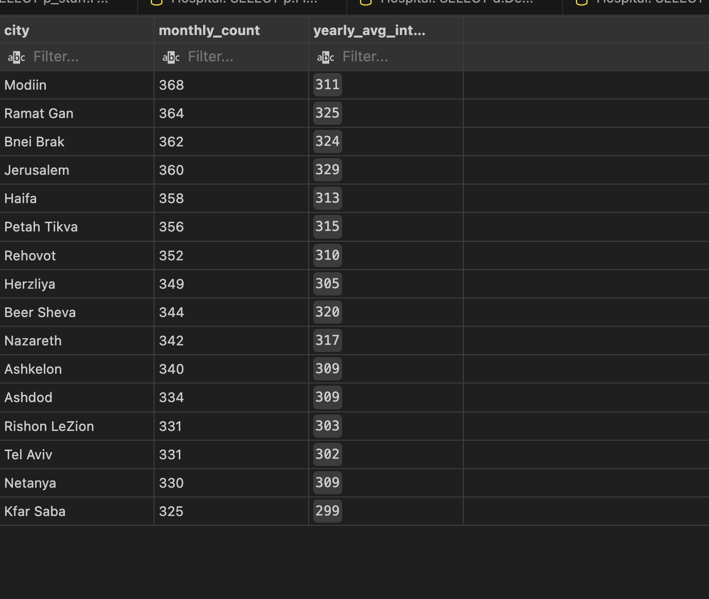

Comparison & Efficiency:
(Explanation here)

📊 Section 2: Additional SELECT Queries
5. Daily Revenue Report (6 Months)
תיאור השאילתא: בקרה תקציבית - דו"ח הכנסות חצי שנתי המחושב לפי מכירת תרופות בטיפולים.

SQL
SELECT 
    m.M_Name,
    COUNT(mg.M_ID) as Times_Sold,
    SUM(m.Price) as Total_Revenue
FROM MEDICATION m
JOIN MEDICATIONS_GIVEN mg ON m.M_ID = mg.M_ID
WHERE mg.Treatment_Date >= NOW() - INTERVAL '6 months'
GROUP BY m.M_ID, m.M_Name
ORDER BY Total_Revenue DESC;
Screenshots:

Query Execution & Result:
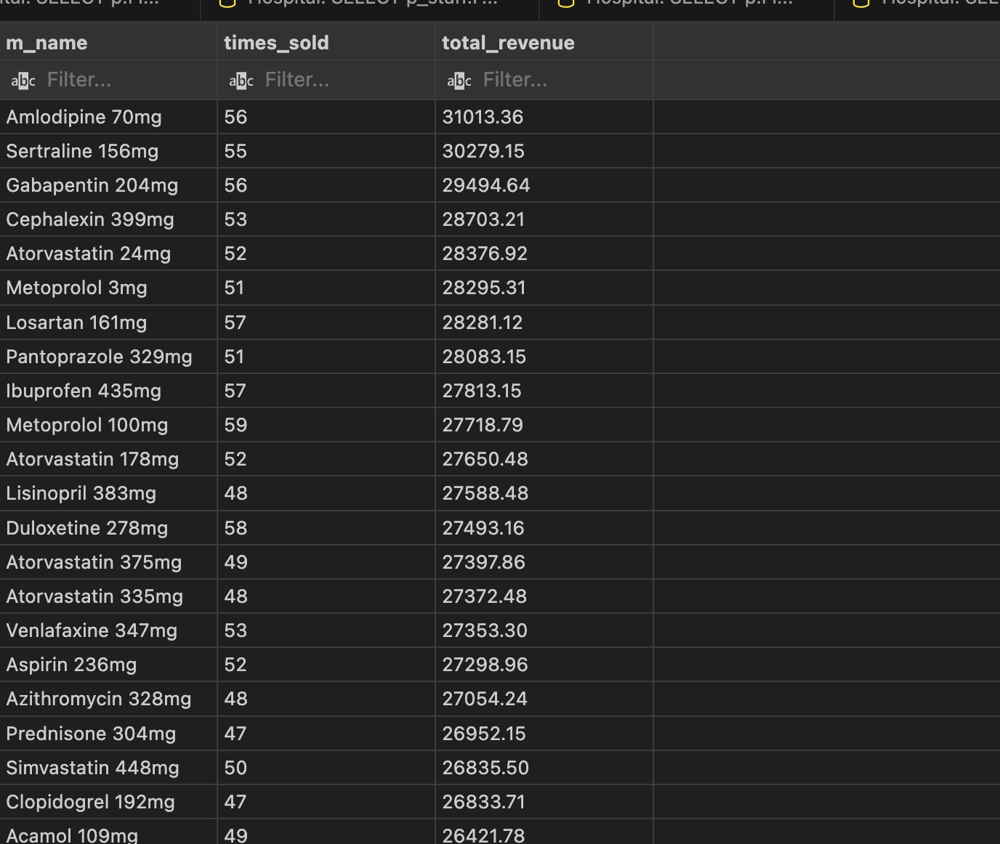

6. Nurse Economic Index
תיאור השאילתא: מדד יעילות אחיות - ניתוח עומס עבודה (משמרות) מול השכר המשולם.

SQL
SELECT 
    p.FirstName || ' ' || p.LastName as Staff_Name,
    COUNT(s.Shift_Date) as Total_Shifts,
    ms.Salary,
    ((COUNT(s.Shift_Date) / NULLIF(ms.Salary, 0))*1000000) as Efficiency_Score
FROM PERSON p
JOIN MEDICAL_STAFF ms ON p.ID = ms.ID
LEFT JOIN SHIFT s ON ms.ID = s.Staff_ID
GROUP BY p.ID, p.FirstName, p.LastName, ms.Salary
ORDER BY Efficiency_Score DESC
LIMIT 50;
Screenshots:

Query Execution & Result:
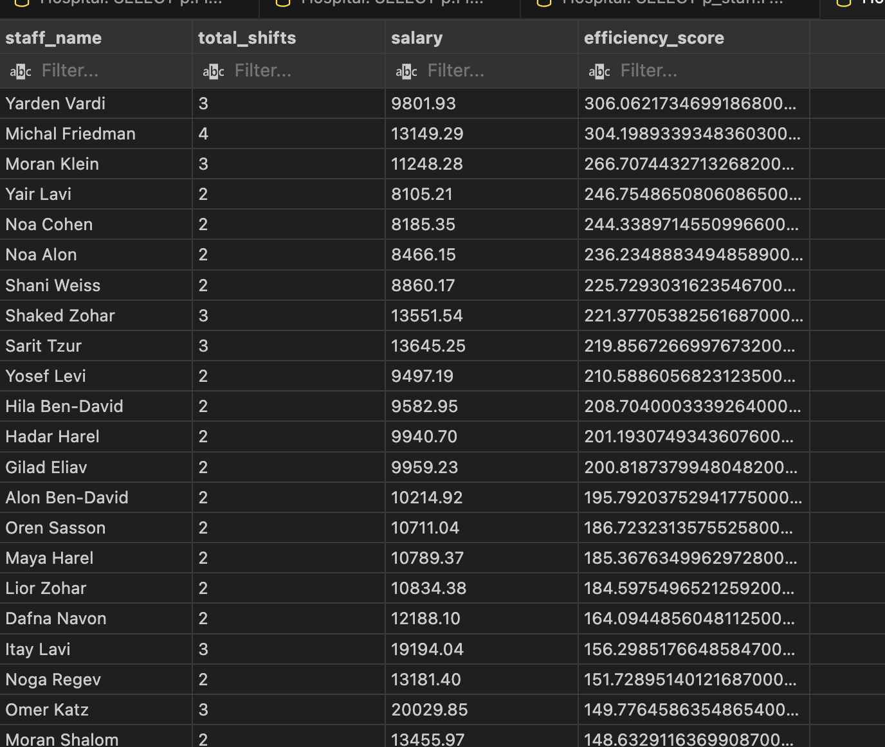

7. Most Common Blood Type per Department
תיאור השאילתא: ניהול מלאי מנות דם - ספירת שכיחות סוגי דם במערכת.

SQL
SELECT 
    BloodType, 
    COUNT(*) as Patient_Count
FROM PATIENT
WHERE BloodType IS NOT NULL
GROUP BY BloodType
ORDER BY Patient_Count DESC;
Screenshots:

Query Execution & Result: 
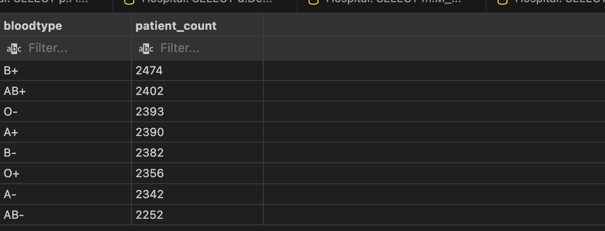

8. High-Risk Elderly Patients Audit
תיאור השאילתא: מעקב חולים מעל גיל 55 שביצעו לפחות 2 טיפולים בחודש האחרון (סיכון גבוה).

SQL
SELECT 
    p.FirstName, 
    p.LastName, 
    EXTRACT(YEAR FROM age(CURRENT_DATE, pat.BirthDate)) as Age,
    COUNT(t.Treatment_Date) as Monthly_Treatments
FROM PERSON p
JOIN PATIENT pat ON p.ID = pat.ID
JOIN TREATMENT t ON pat.ID = t.Patient_ID
WHERE pat.BirthDate <= CURRENT_DATE - INTERVAL '55 years'
  AND t.Treatment_Date >= CURRENT_DATE - INTERVAL '1 month'
GROUP BY p.ID, p.FirstName, p.LastName, pat.BirthDate
HAVING COUNT(t.Treatment_Date) >= 2;
Screenshots:

Query Execution & Result:
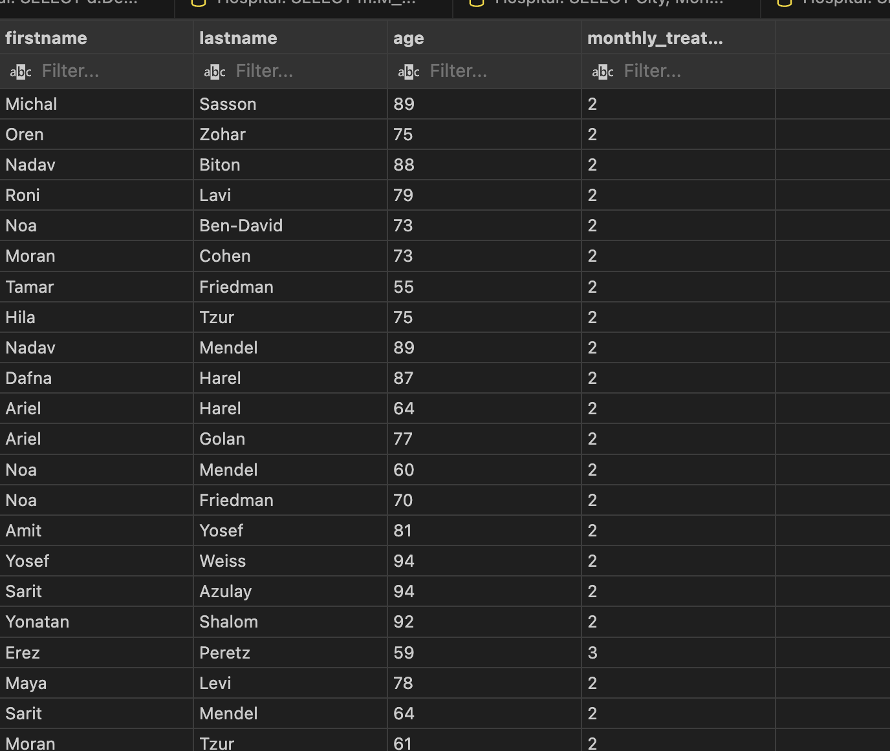

🛠 Section 3: Data Manipulation (UPDATE & DELETE)
1. UPDATE: Salary Adjustment
-- מעלה שכר ב-10% למי שביצע מעל 130 טיפולים בשנה האחרונה
UPDATE MEDICAL_STAFF
SET Salary = Salary * 1.10
WHERE ID IN (
    SELECT Doctor_ID 
    FROM TREATMENT 
    WHERE Treatment_Date >= CURRENT_DATE - INTERVAL '1 year'
    GROUP BY Doctor_ID 
    HAVING COUNT(*) > 130
);

Before Update:
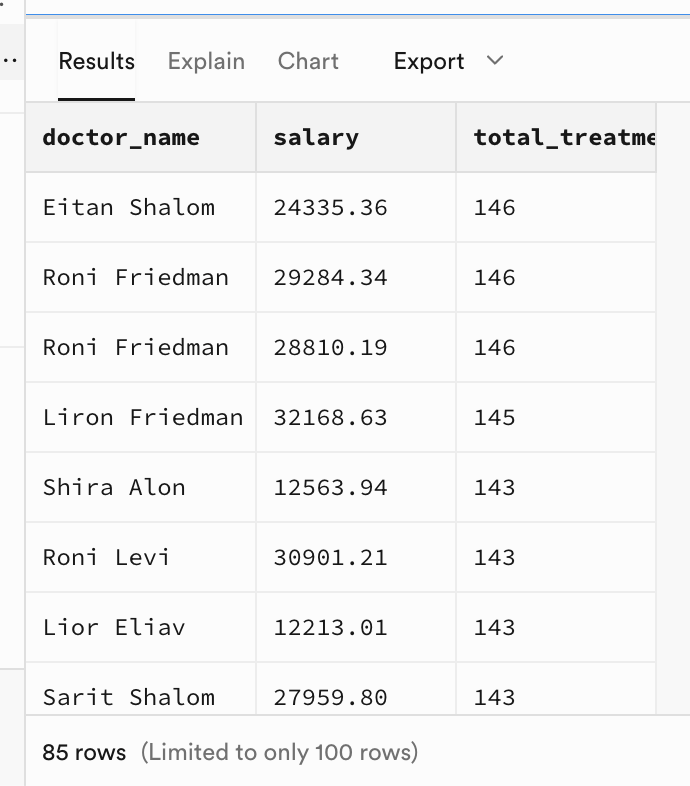

After Update:
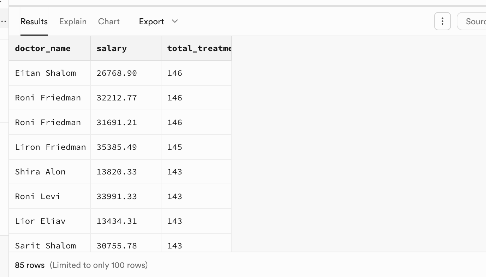

2. UPDATE: location of sttaf 
עובד עובר דירה, אם יש אנשים שגרים איתו, אני מניח שהם משפחה. נעביר גם אותם
-- עדכון כתובת לאיש צוות וכל מי שגר איתו באותה דירה
UPDATE PERSON
SET City = 'Haifa', -- לפה
    Street = 'Herzl', 
    HouseNumber = 10, 
    ApartmentNumber = 2
WHERE City = 'Tel Aviv' --מפה 
  AND Street = 'HaYarkon' 
  AND HouseNumber = 15 
  AND ApartmentNumber = 4;

Before:
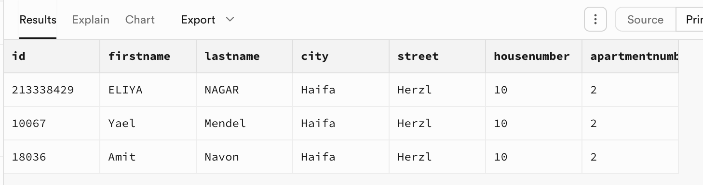

Doring:
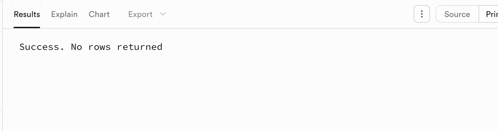

After:
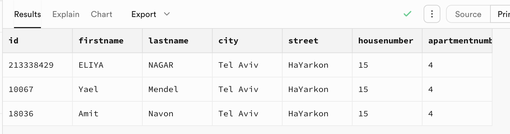

3. UPDATE: meds frice.
-- מעלה מחיר ב-5% לתרופות שניתנו מעל 100 פעמים
UPDATE MEDICATION
SET Price = Price * 1.05
WHERE M_ID IN (
    SELECT M_ID 
    FROM MEDICATIONS_GIVEN
    GROUP BY M_ID 
    HAVING COUNT(*) > 100
);

Before:
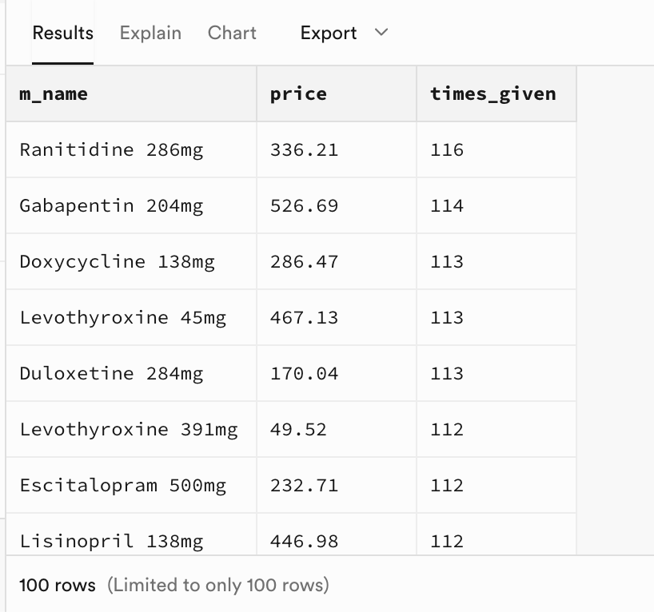

After:

1. DELETE: delete all mads that given lass then X. itmes
-- שלב א: מציאת ה-IDs של התרופות שניתנו פחות מ-20 פעמים
WITH LowUsageMeds AS (
    SELECT m_id
    FROM MEDICATION
    WHERE m_id NOT IN (
        SELECT m_id 
        FROM MEDICATIONS_GIVEN 
        GROUP BY m_id 
        HAVING COUNT(*) >= 68
    )
)
-- שלב ב: מחיקת הרישומים של התרופות האלו מטבלת הטיפולים (כדי לשחרר את המפתח הזר)
DELETE FROM MEDICATIONS_GIVEN
WHERE m_id IN (SELECT m_id FROM LowUsageMeds);

-- שלב ג: עכשיו אפשר למחוק את התרופות עצמן בביטחון
DELETE FROM MEDICATION
WHERE m_id NOT IN (
    SELECT m_id 
    FROM MEDICATIONS_GIVEN 
    GROUP BY m_id 
    HAVING COUNT(*) >= 68
);

Before:
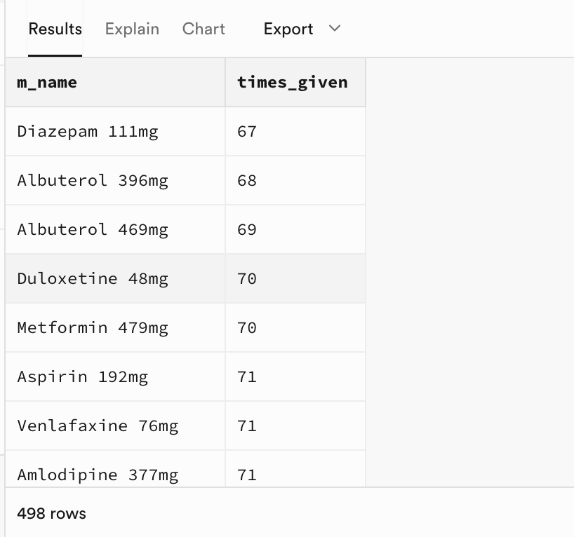

After:
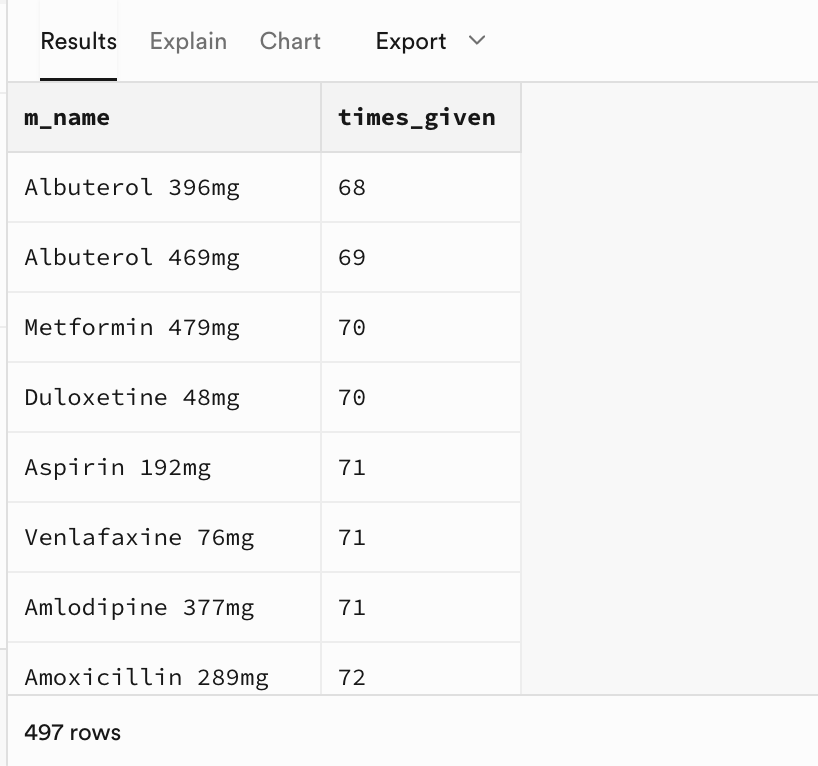

2. DELETE: Remove Ghost Patients
מלל בעברית: מחיקת חולים שמעולם לא עברו טיפול כדי לשמור על בסיס נתונים נקי.
-- מחיקת חולים שמעולם לא עברו טיפול
DELETE FROM PATIENT p
WHERE NOT EXISTS (
    SELECT 1 
    FROM TREATMENT t 
    WHERE t.Patient_ID = p.ID
);

Screenshots:

Before Delete:

After Delete:
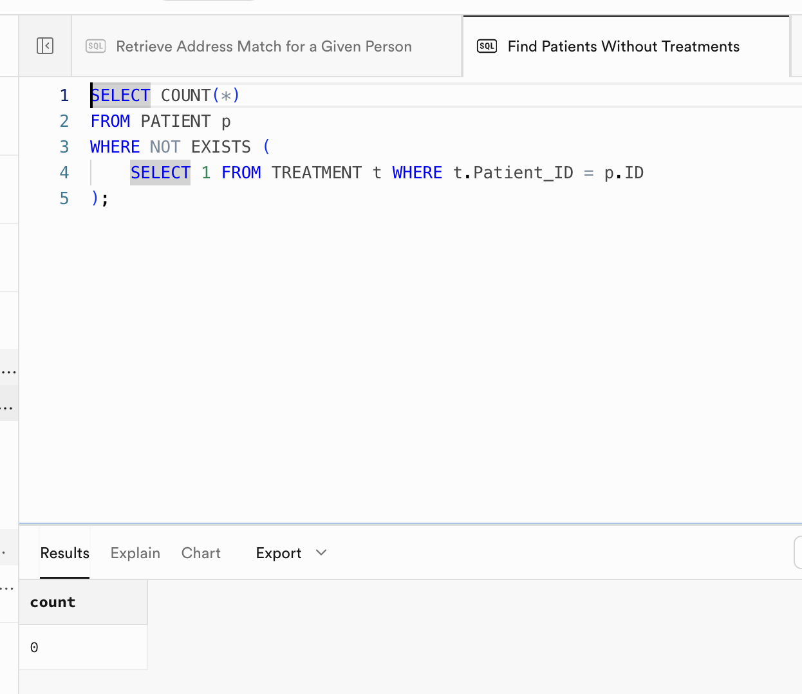

3. DELETE: letting sttaf go
-- פיטורי איש צוות עם ID מסוים (למשל 123456789)
-- שלב 1: מחיקה מטבלת המשמרות (staff_id בתרשים)
DELETE FROM SHIFT 
WHERE staff_id = 213338429;
-- שלב 2: מחיקה מטבלת התפקיד (בתרשים מופיע כ-ID)
DELETE FROM ATTENDING_DOCTOR 
WHERE doctor_id = 213338429;
-- שלב 3: מחיקה מטבלת הצוות הרפואי
DELETE FROM MEDICAL_STAFF 
WHERE id = 213338429;

Before Delete:
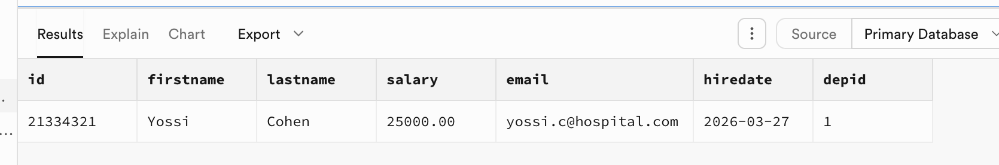

After Delete:
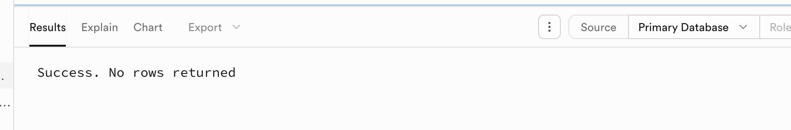

Rollback:
Before:
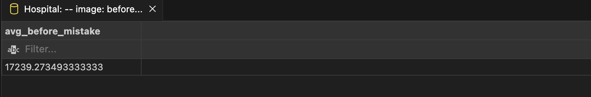

Doring:
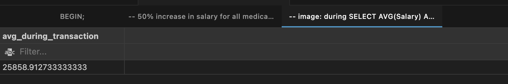

After:
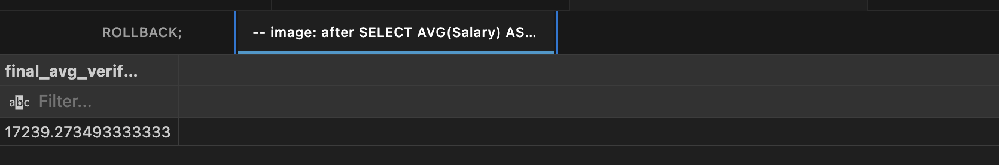

Commit:
Before:
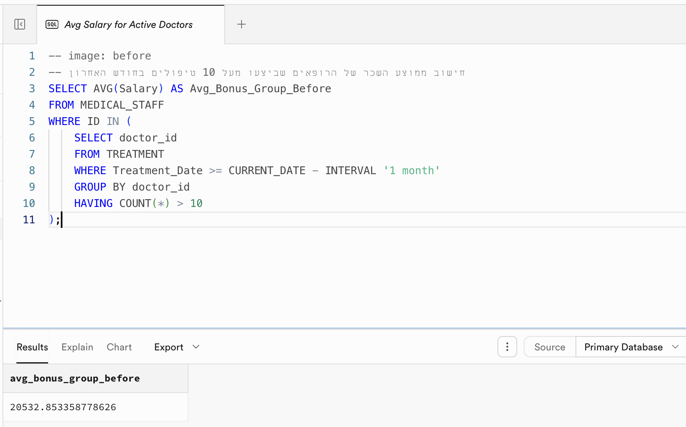

Doring:
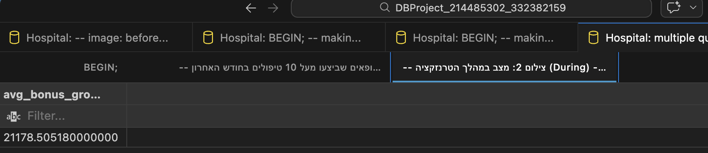

After:
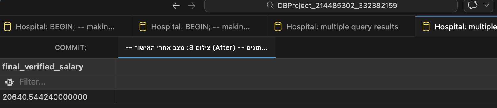

starting the integration

## מודול אינטגרציית תיק רפואי מאוחד (Unified EHR Integration)

מודול זה מדגים אינטגרציית נתונים מתקדמת בין שני מסדי נתונים מבוזרים (Distributed Databases) של בתי חולים שונים. באמצעות שימוש בטכנולוגיית עבודה מול שרת מרוחק (כגון Foreign Data Wrapper / FDW), המערכת מסוגלת לתשאל בזמן אמת גם את המסד המקומי וגם את סכימת השותף (`remote_partner`), ולהציג לצוות הרפואי ציר זמן כרונולוגי שלם של היסטוריית המטופל במבנה נתונים אחד נקי ואחיד.

**מאפיינים טכניים מרכזיים בשאילתת האינטגרציה:**

* **האחדת סכימות (Schema Harmonization):** שימוש ב-`UNION ALL` תוך מיפוי עמודות שונות משלוש טבלאות נפרדות בעלות מבנה שונה (`TREATMENT` המקומית, `VISITS` ו-`INPATIENT_ADMISSIONS` המרוחקות) לכדי תצוגה טבלאית אחידה (Flat View) הכוללת את עמודות הליבה הרפואיות בלבד.
* **העשרת נתונים (Data Enrichment):** הזרקת נתונים קריטיים מהמסד המקומי (סוג הדם של המטופל מטבלת `PATIENT`) לתוך רשומות המידע המיובאות מהמסד המרוחק. פעולה זו מספקת לרופא תמונה קלינית מלאה ובטוחה יותר, גם עבור אירועים שהתרחשו מחוץ לבית החולים המקומי.
* **טיפול בחוסר תאימות מבנית (Handling Structural Mismatches):** התמודדות יעילה עם פערים בין הסכימות של שני מסדי הנתונים. המערכת עושה שימוש מושכל ב-`NULL` Casting (למשל `NULL::INT` או `NULL::DATE`) ובערכי טקסט מותאמים אישית כדי לגשר על שדות חסרים (כגון היעדר שיוך רופא ספציפי באשפוזים מרוחקים), תוך מניעת שגיאות של טיפוסי נתונים.
* **שאילתות Join מורכבות (Complex Multi-Table Joins):** שליפת שמות רופאים ותרופות במקביל משתי המערכות על ידי שרשור `LEFT JOIN` למספר טבלאות עזר במקביל (חיבור ל-`PERSON` ו-`MEDICATION` בצד המקומי, מול `STAFF`, `PRESCRIPTIONS` ו-`MEDICATIONS` בצד המרוחק).

