# DBProject_214485302_332382159

## Cover Page

**Submitted by:** 214485302, 332382159

**System:** Hospital Management System

**Selected Unit:** Medical Staff, Patients, and Treatments Management

---

## Table of Contents

1. [Introduction](#introduction)
2. [System Design](#system-design)
3. [ERD Diagram](#erd-diagram)
4. [DSD Diagram](#dsd-diagram)
5. [Design Decisions](#design-decisions)
6. [Data Insertion](#data-insertion)
7. [Backup and Restore](#backup-and-restore)

---

## Introduction

The system is designed for hospital management and enables tracking of medical staff, patients, treatments, and medications.

**Data stored in the system:**
- **Person** — Basic details of every individual in the system (name, phone number)
- **Medical Staff** — Medical employees including salary, email, and hire date
- **Patient** — Hospital patients with birth date and blood type
- **Attending Doctor** — Doctors assigned to departments
- **Nurse** — Nurses with specialization and shift type
- **Researcher** — Researchers working in laboratories
- **Department** — Hospital departments with number of beds
- **Lab** — Research laboratories with number of technicians
- **Medication** — Medication catalog with prices
- **Shift** — Staff shifts with start and end times
- **Treatment** — Treatments given to patients by doctors
- **Medications Given** — Link between treatments and medications administered

**Main functionality:**
- Managing and tracking medical staff (doctors, nurses, researchers)
- Assigning staff to departments and laboratories
- Shift management
- Tracking treatments and medications given to patients
- Department and laboratory management

---

## System Design


---

## ERD Diagram

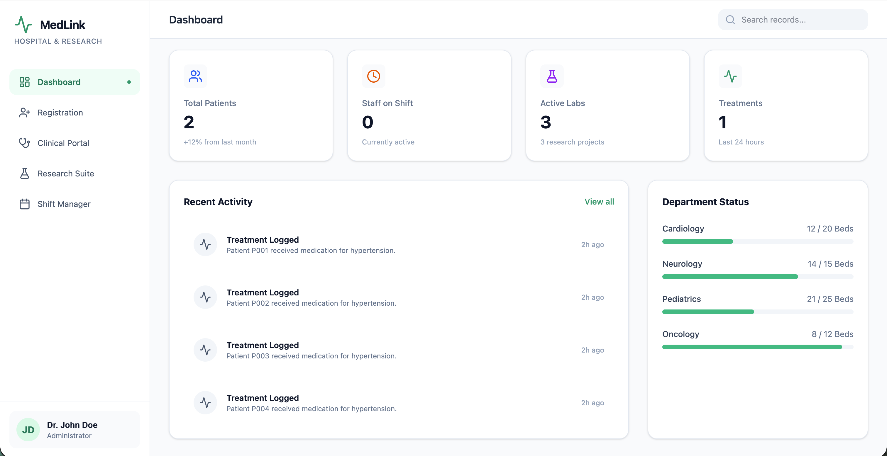

---

## DSD Diagram

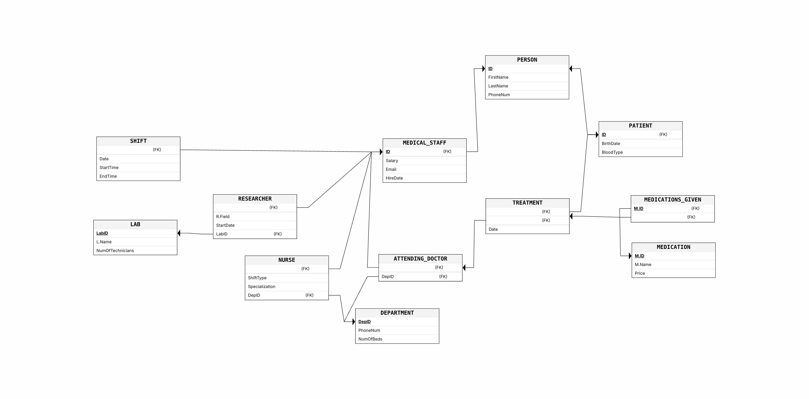

---

## Design Decisions

1. **Inheritance (ISA):** The `Person` entity serves as the supertype. `Medical_Staff` and `Patient` inherit from it. Within `Medical_Staff` there are three subtypes: `Attending_Doctor`, `Nurse`, and `Researcher`. Inheritance is implemented using a foreign key that is also a primary key (ID) — so every record in `Medical_Staff` must first exist in `Person`.

2. **Meaningful DATE fields:**
   - `HireDate` in `MEDICAL_STAFF` — Employee hire date
   - `BirthDate` in `PATIENT` — Patient birth date
   - `Treatment_Date` in `TREATMENT` — Treatment date
   - `StartDate` in `RESEARCHER` — Research start date
   - `Shift_Date` in `SHIFT` — Shift date

3. **Constraints:**
   - `Salary > 0` — Salary must be positive
   - `Price >= 0` — Medication price cannot be negative
   - `NumOfBeds >= 0` — Number of beds cannot be negative
   - `NumOfTechnicians >= 0` — Number of technicians cannot be negative
   - `BloodType IN ('A+','A-','B+','B-','AB+','AB-','O+','O-')` — Only valid blood type values
   - `Email UNIQUE` — Unique email address per employee

4. **Relationships:**
   - `Treatment` — Many-to-many relationship between `Patient` and `Attending_Doctor` with date as part of the key
   - `Medications_Given` — Many-to-many relationship between `Treatment` and `Medication`
   - `Shift` — Weak entity dependent on `Medical_Staff`

---

## Data Insertion

Data was inserted using 3 different methods:

### Method 1: CSV File Import (`DataImportFiles/`)

CSV files were generated using a Python script (`generate_csv.py`).

**Tables:**
| Table | Record Count |
|-------|-------------|
| PERSON | 21,500 |
| PATIENT | 20,000 |

Data was imported into the database using SQL*Loader with control files (`.ctl`).

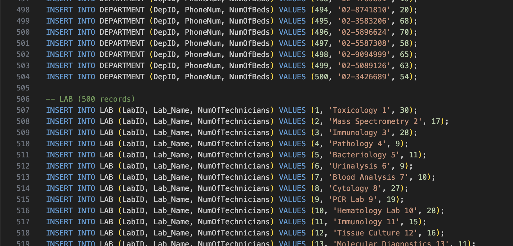

### Method 2: Programming — Python-generated INSERT statements (`Programing/`)

A Python script (`generate_inserts.py`) generates a SQL file with INSERT statements.

**Tables:**
| Table | Record Count |
|-------|-------------|
| MEDICAL_STAFF | 1,500 |
| ATTENDING_DOCTOR | 500 |
| NURSE | 500 |
| RESEARCHER | 500 |
| SHIFT | 500 |
| TREATMENT | 20,000 |
| MEDICATIONS_GIVEN | 500 |


### Method 3: generatedata — INSERT statement generation (`generatedataFiles/`)

INSERT statements were generated for the following tables:

**Tables:**
| Table | Record Count |
|-------|-------------|
| DEPARTMENT | 500 |
| LAB | 500 |
| MEDICATION | 500 |


### Record Count Summary

| Table | Record Count | Method |
|-------|-------------|--------|
| PERSON | 21,500 | CSV Import |
| PATIENT | 20,000 | CSV Import |
| TREATMENT | 20,000 | Python INSERT |
| MEDICAL_STAFF | 1,500 | Python INSERT |
| DEPARTMENT | 500 | generatedata |
| LAB | 500 | generatedata |
| MEDICATION | 500 | generatedata |
| ATTENDING_DOCTOR | 500 | Python INSERT |
| NURSE | 500 | Python INSERT |
| RESEARCHER | 500 | Python INSERT |
| SHIFT | 500 | Python INSERT |
| MEDICATIONS_GIVEN | 500 | Python INSERT |

---

## Backup and Restore

### Backup

Backup was performed using Oracle Data Pump Export (`expdp`).

Backup file is saved in the format: `backup_YYYY-MM-DD.dmp`

Backup script: `backup.bat`


### Restore

Restore was performed on a different machine using Oracle Data Pump Import (`impdp`).

Restore script: `restore.bat`


---

## Stage B — Queries, Constraints, Indexes

---

## 🔍 Section 1: Comparative SELECT Queries (4 queries × 2 versions)

Four queries are each written in two ways. For each pair: Version A is the efficient approach, Version B is the inefficient approach, followed by an explanation of the difference.

---

### Query 4: Monthly Outbreak Alert — התראת עלייה חודשית בתחלואה

**תיאור:** השאילתה מזהה, לכל עיר, את החודש שבו מספר הטיפולים היה הגבוה ביותר ועלה מעל הממוצע השנתי. משתמשת בשדה `Treatment_Date` ובשדה `City` מטבלאות `PERSON` ו-`TREATMENT`.

**Version A — Window Functions (יעיל):**

```sql
SELECT City, Monthly_Count, Yearly_Avg_Integer
FROM (
    SELECT
        City,
        Monthly_Count,
        CAST(Yearly_Avg AS INT) AS Yearly_Avg_Integer,
        ROW_NUMBER() OVER(PARTITION BY City ORDER BY Monthly_Count DESC) AS rank_per_city
    FROM (
        SELECT
            p.City,
            COUNT(*) OVER(PARTITION BY p.City, EXTRACT(MONTH FROM t.Treatment_Date)) AS Monthly_Count,
            COUNT(*) OVER(PARTITION BY p.City) / 12.0 AS Yearly_Avg
        FROM PERSON p
        JOIN TREATMENT t ON p.ID = t.Patient_ID
    ) Stats
    WHERE Monthly_Count > Yearly_Avg
) RankedStats
WHERE rank_per_city = 1
ORDER BY Monthly_Count DESC;
```

**Version B — Correlated Subqueries (פחות יעיל):**

```sql
SELECT DISTINCT
    p.City,
    (SELECT COUNT(*)
     FROM TREATMENT t2
     JOIN PERSON p2 ON t2.Patient_ID = p2.ID
     WHERE p2.City = p.City
       AND EXTRACT(MONTH FROM t2.Treatment_Date) = EXTRACT(MONTH FROM t.Treatment_Date)
    ) AS Monthly_Count,
    (SELECT COUNT(*)
     FROM TREATMENT t3
     JOIN PERSON p3 ON t3.Patient_ID = p3.ID
     WHERE p3.City = p.City) / 12 AS Yearly_Avg_Integer
FROM PERSON p
JOIN TREATMENT t ON p.ID = t.Patient_ID
WHERE
    (SELECT COUNT(*) FROM TREATMENT t2 JOIN PERSON p2 ON t2.Patient_ID = p2.ID
     WHERE p2.City = p.City
       AND EXTRACT(MONTH FROM t2.Treatment_Date) = EXTRACT(MONTH FROM t.Treatment_Date))
     >
    (SELECT COUNT(*) FROM TREATMENT t3 JOIN PERSON p3 ON t3.Patient_ID = p3.ID
     WHERE p3.City = p.City) / 12.0
    AND
    (SELECT COUNT(*) FROM TREATMENT t2 JOIN PERSON p2 ON t2.Patient_ID = p2.ID
     WHERE p2.City = p.City
       AND EXTRACT(MONTH FROM t2.Treatment_Date) = EXTRACT(MONTH FROM t.Treatment_Date))
     = (SELECT MAX(month_total) FROM (
            SELECT COUNT(*) AS month_total
            FROM TREATMENT t4 JOIN PERSON p4 ON t4.Patient_ID = p4.ID
            WHERE p4.City = p.City
            GROUP BY EXTRACT(MONTH FROM t4.Treatment_Date)
        ) InnerSub)
ORDER BY Monthly_Count DESC;
```

**תוצאה:**
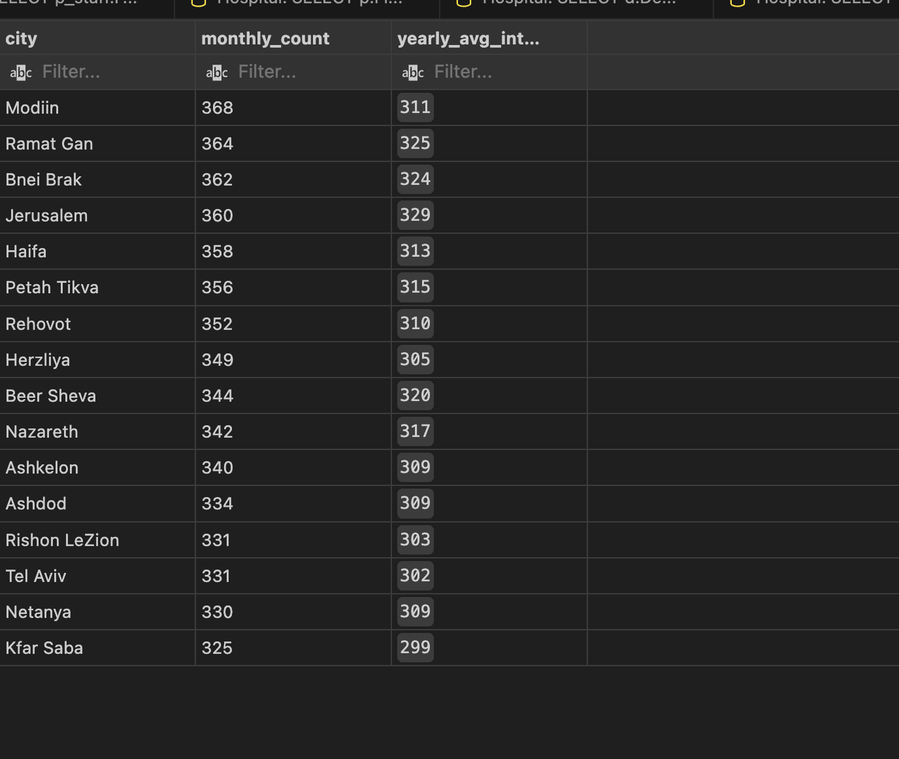

**הסבר ההבדל ביעילות:**

| | Version A | Version B |
|---|---|---|
| **גישה לטבלה** | פעם אחת בלבד (Single Pass) | לכל שורה בתוצאה — ריצת 3–4 תת-שאילתות על כל TREATMENT |
| **מורכבות** | O(n log n) — מיון בלבד | O(n × m) — n שורות × m גודל הטבלה |
| **טכניקה** | `COUNT() OVER(PARTITION BY)` מחשב הכל במעבר יחיד | כל תת-שאילתה מריצה סריקה מלאה חדשה |
| **הפרת חישוב** | `ROW_NUMBER()` מוצא שיא בלי שאילתה נוספת | ה-WHERE מחשב את אותה ספירה **שלוש פעמים** |

**מסקנה:** Version A עדיף משמעותית. בנתוני אמת (20,000 טיפולים), Version B יכול לקחת עשרות שניות; Version A — אלפיות שנייה.

---

### Query 5: Revenue Report — דו"ח הכנסות תרופות (6 חודשים)

**תיאור:** מחשבת לכל תרופה את סך הכמות שנמכרה וסך ההכנסה בחצי השנה האחרונה. משתמשת בשדה `Treatment_Date` ומחברת `MEDICATION` עם `MEDICATIONS_GIVEN`.

**Version A — JOIN + GROUP BY (יעיל):**

```sql
SELECT
    m.M_Name,
    COUNT(mg.M_ID)  AS Times_Sold,
    SUM(m.Price)    AS Total_Revenue
FROM MEDICATION m
JOIN MEDICATIONS_GIVEN mg ON m.M_ID = mg.M_ID
WHERE mg.Treatment_Date >= NOW() - INTERVAL '6 months'
GROUP BY m.M_ID, m.M_Name
ORDER BY Total_Revenue DESC;
```

**Version B — Correlated Subqueries (פחות יעיל):**

```sql
SELECT
    m.M_Name,
    (SELECT COUNT(*)
     FROM MEDICATIONS_GIVEN mg
     WHERE mg.M_ID = m.M_ID
       AND mg.Treatment_Date >= NOW() - INTERVAL '6 months'
    ) AS Times_Sold,
    (SELECT SUM(m2.Price)
     FROM MEDICATIONS_GIVEN mg2
     JOIN MEDICATION m2 ON mg2.M_ID = m2.M_ID
     WHERE mg2.M_ID = m.M_ID
       AND mg2.Treatment_Date >= NOW() - INTERVAL '6 months'
    ) AS Total_Revenue
FROM MEDICATION m
ORDER BY (
    SELECT SUM(m3.Price)
    FROM MEDICATIONS_GIVEN mg3
    JOIN MEDICATION m3 ON mg3.M_ID = m3.M_ID
    WHERE mg3.M_ID = m.M_ID
      AND mg3.Treatment_Date >= NOW() - INTERVAL '6 months'
) DESC;
```

**תוצאה:**
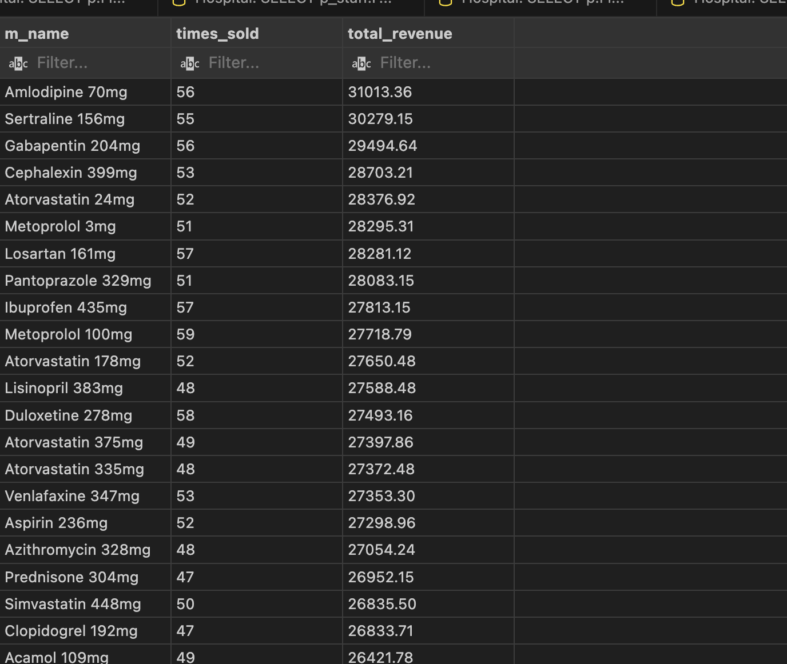

**הסבר ההבדל ביעילות:**

| | Version A | Version B |
|---|---|---|
| **גישה לטבלה** | JOIN יחיד + GROUP BY = סריקה אחת | 2 תת-שאילתות ב-SELECT + תת-שאילתה נוספת ב-ORDER BY |
| **כמות סריקות** | 1 | **3 × מספר התרופות (500)** = 1,500 סריקות |
| **GROUP BY** | מסכם הכל בבניית Hash Table אחת | אין GROUP BY — כל תרופה מחושבת בנפרד |
| **ORDER BY** | ממיין לפי עמודה מחושבת קיימת | מחשב מחדש SUM לכל שורה רק לצורך המיון |

**מסקנה:** Version A עדיף. Version B סובל מבעיית N+1 קלאסית — עבור כל תרופה הוא מריץ שלוש שאילתות נפרדות.

---

### Query 7: Blood Type Distribution — התפלגות סוגי דם

**תיאור:** ספירת כמות החולים לפי סוג דם. מספקת מידע לניהול מלאי בנק הדם.

**Version A — GROUP BY (יעיל):**

```sql
SELECT
    BloodType,
    COUNT(*) AS Patient_Count
FROM PATIENT
WHERE BloodType IS NOT NULL
GROUP BY BloodType
ORDER BY Patient_Count DESC;
```

**Version B — DISTINCT + Correlated Subquery (פחות יעיל):**

```sql
SELECT DISTINCT
    p1.BloodType,
    (SELECT COUNT(*)
     FROM PATIENT p2
     WHERE p2.BloodType = p1.BloodType) AS Patient_Count
FROM PATIENT p1
WHERE p1.BloodType IS NOT NULL
ORDER BY (
    SELECT COUNT(*)
    FROM PATIENT p3
    WHERE p3.BloodType = p1.BloodType
) DESC;
```

**תוצאה:**
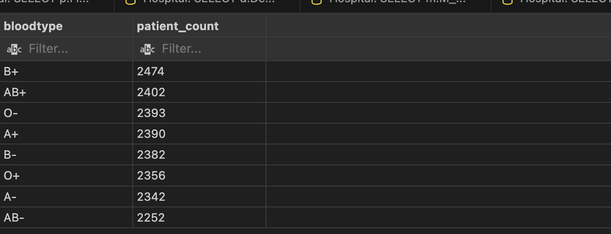

**הסבר ההבדל ביעילות:**

| | Version A | Version B |
|---|---|---|
| **גישה לטבלה** | סריקה אחת של PATIENT | סריקה מלאה של PATIENT **לכל סוג דם** |
| **כמות סריקות** | 1 | 8 סוגי דם × 2 (SELECT + ORDER BY) = **16 סריקות** |
| **טכניקה** | Hash Aggregate — צובר בזיכרון במעבר יחיד | לכל ערך ייחודי ב-DISTINCT, מריץ COUNT מחדש |
| **DISTINCT** | לא נדרש — GROUP BY מייצר שורה לכל ערך ממילא | DISTINCT כאן הוא workaround יקר |

**מסקנה:** Version A עדיף. השאילתה פשוטה ו-GROUP BY תמיד עדיף על DISTINCT + correlated subquery.

---

### Query 8: High-Risk Elderly Patients — חולים מבוגרים בסיכון גבוה

**תיאור:** מאתרת חולים מעל גיל 55 שביצעו לפחות 2 טיפולים בחודשיים האחרונים. משתמשת בשדה `BirthDate` ובשדה `Treatment_Date`.

**Version A — JOIN + GROUP BY + HAVING (יעיל):**

```sql
SELECT
    p.FirstName,
    p.LastName,
    EXTRACT(YEAR FROM age(CURRENT_DATE, pat.BirthDate)) AS Age,
    COUNT(t.Treatment_Date) AS Monthly_Treatments
FROM PERSON p
JOIN PATIENT pat ON p.ID = pat.ID
JOIN TREATMENT t ON pat.ID = t.Patient_ID
WHERE pat.BirthDate <= CURRENT_DATE - INTERVAL '55 years'
  AND t.Treatment_Date >= CURRENT_DATE - INTERVAL '2 months'
GROUP BY p.ID, p.FirstName, p.LastName, pat.BirthDate
HAVING COUNT(t.Treatment_Date) >= 2;
```

**Version B — Correlated Subqueries (פחות יעיל):**

```sql
SELECT
    p.FirstName,
    p.LastName,
    (SELECT EXTRACT(YEAR FROM age(CURRENT_DATE, pat.BirthDate))
     FROM PATIENT pat
     WHERE pat.ID = p.ID) AS Age,
    (SELECT COUNT(*)
     FROM TREATMENT t
     WHERE t.Patient_ID = p.ID
       AND t.Treatment_Date >= CURRENT_DATE - INTERVAL '2 months') AS Monthly_Treatments
FROM PERSON p
WHERE
    (SELECT BirthDate FROM PATIENT pat WHERE pat.ID = p.ID)
        <= CURRENT_DATE - INTERVAL '55 years'
    AND
    (SELECT COUNT(*) FROM TREATMENT t
     WHERE t.Patient_ID = p.ID
       AND t.Treatment_Date >= CURRENT_DATE - INTERVAL '2 months') >= 2;
```

**תוצאה:**
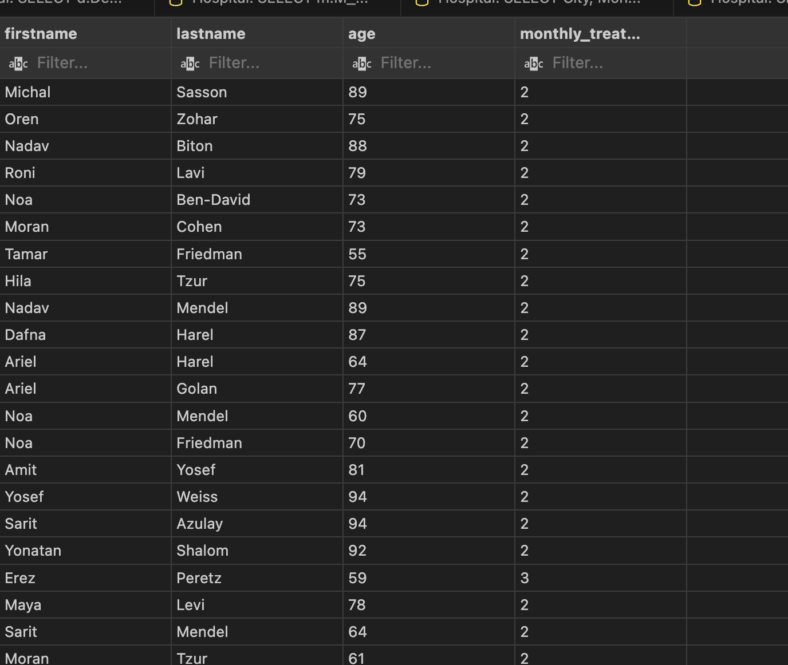

**הסבר ההבדל ביעילות:**

| | Version A | Version B |
|---|---|---|
| **גישה לטבלה** | JOIN אחד לכל טבלה | 3 תת-שאילתות לכל **אדם** ב-PERSON (21,500 אנשים) |
| **כמות סריקות** | 3 סריקות (PERSON, PATIENT, TREATMENT) | עד **21,500 × 3 = 64,500 סריקות** |
| **סינון מוקדם** | WHERE מסנן לפני JOIN — מצמצם את הנתונים מהר | WHERE מחשב subquery לכל שורה לפני שיודע לסנן |
| **HAVING** | מסנן קבוצות אחרי GROUP BY — יעיל | הסינון ב-WHERE מריץ COUNT פעמיים לכל שורה |

**מסקנה:** Version A עדיף בהפרש גדול. בטבלת PERSON עם 21,500 רשומות, Version B מריץ עשרות אלפי סריקות נוספות.

---

## 📊 Section 2: Additional SELECT Queries

---

### Query 1: Doctor Efficiency Ranking — דירוג כלכליות רופאים

**תיאור:** מחשבת "מדד רווחיות" לכל רופא — שכר חלקי מספר טיפולים. מציגה את 50 הרופאים הכלכליים ביותר.

**ב-GUI:** דאשבורד הנהלה תחת "ניתוח כלכלי של כוח אדם".

```sql
SELECT
    p.FirstName || ' ' || p.LastName AS Doctor_Name,
    COUNT(t.Treatment_Date)          AS Total_Treatments,
    ms.Salary,
    (NULLIF(ms.Salary, 0) / COUNT(t.Treatment_Date)) AS Profitability_Index
FROM PERSON p
JOIN MEDICAL_STAFF ms    ON p.ID = ms.ID
JOIN ATTENDING_DOCTOR ad ON ms.ID = ad.Doctor_ID
LEFT JOIN TREATMENT t    ON ad.Doctor_ID = t.Doctor_ID
GROUP BY p.ID, p.FirstName, p.LastName, ms.Salary
ORDER BY Profitability_Index DESC
LIMIT 50;
```

**תוצאה:**
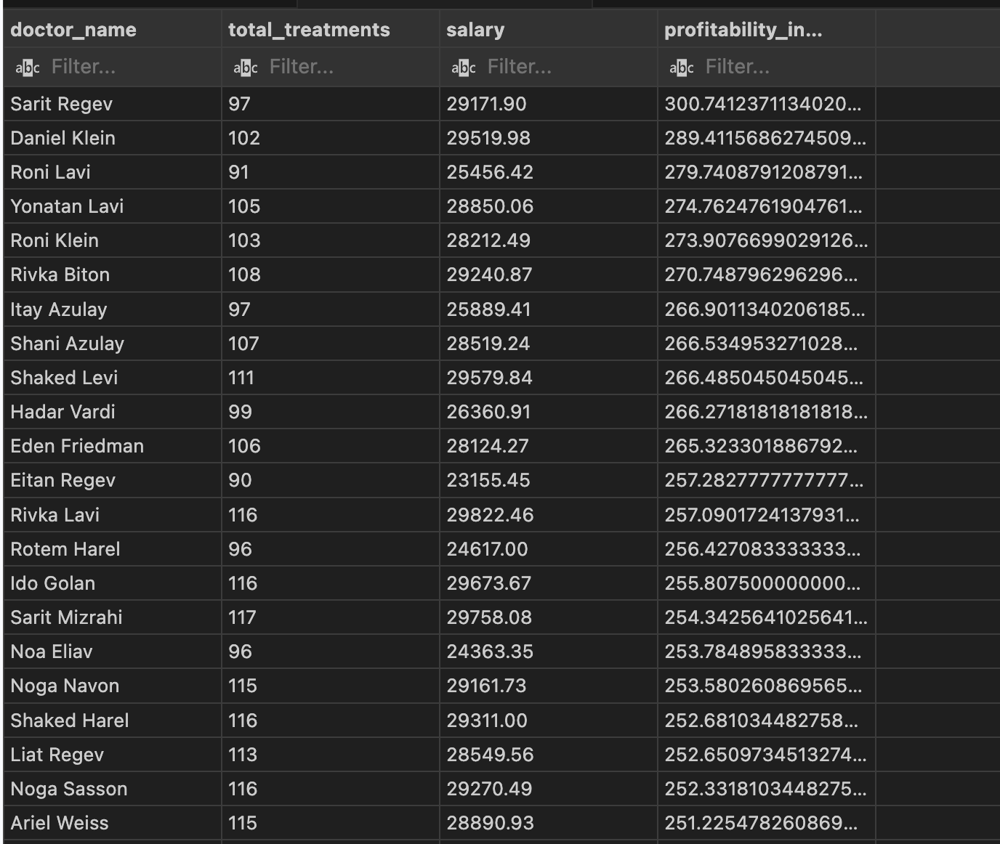

---

### Query 2: Local On-Call Doctors — רופאים כוננים לפי קרבה גאוגרפית

**תיאור:** מזהה רופאים שביצעו טיפול ביום האחרון למטופל שגר באותה עיר שלהם.

**ב-GUI:** מפה אינטראקטיבית לשיבוץ כוננות חירום.

```sql
SELECT p_staff.FirstName, p_staff.LastName, p_staff.City
FROM PERSON p_staff
WHERE EXISTS (
    SELECT 1
    FROM TREATMENT t
    JOIN PERSON p_pat ON t.Patient_ID = p_pat.ID
    WHERE t.Doctor_ID = p_staff.ID
      AND p_pat.City = p_staff.City
      AND t.Treatment_Date >= CURRENT_DATE - INTERVAL '1 day'
);
```

**תוצאה:**
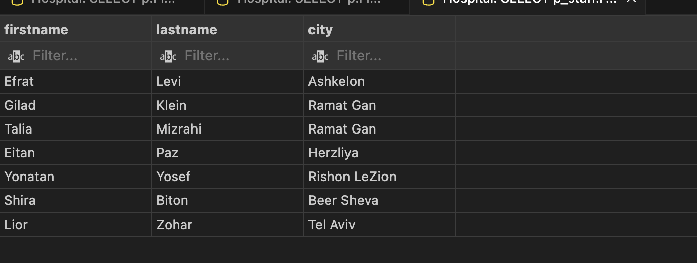

---

### Query 3: Operational Bed Capacity — תפוסת מיטות במחלקות

**תיאור:** מחשבת מיטות פנויות בכל מחלקה על סמך חולים שטופלו בחודשיים האחרונים.

**ב-GUI:** דאשבורד "סטטוס מחלקות" בזמן אמת.

```sql
SELECT
    d.DepID,
    d.NumOfBeds                          AS Total_Capacity,
    COUNT(DISTINCT t.Patient_ID)         AS Occupied_Beds,
    (d.NumOfBeds - COUNT(DISTINCT t.Patient_ID)) AS Available_Beds
FROM DEPARTMENT d
LEFT JOIN ATTENDING_DOCTOR ad ON d.DepID = ad.DepID
LEFT JOIN TREATMENT t ON ad.Doctor_ID = t.Doctor_ID
    AND t.Treatment_Date >= NOW() - INTERVAL '2 months'
GROUP BY d.DepID, d.NumOfBeds
ORDER BY Available_Beds DESC;
```

**תוצאה:**
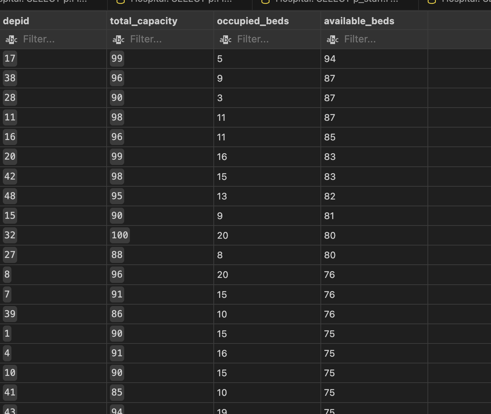

---

### Query 6: Nurse Efficiency Score — מדד יעילות אחיות

**תיאור:** מחשבת "עלות למשמרת" לכל אחות — שכר חלקי מספר משמרות. מאפשרת זיהוי אחיות עמוסות מול שכרן.

**ב-GUI:** מסך HR לבונוסים ואיזון משמרות.

```sql
SELECT
    p.FirstName || ' ' || p.LastName AS Staff_Name,
    COUNT(s.Shift_Date)              AS Total_Shifts,
    ms.Salary,
    ((COUNT(s.Shift_Date) / NULLIF(ms.Salary, 0)) * 1000000) AS Efficiency_Score
FROM PERSON p
JOIN MEDICAL_STAFF ms ON p.ID = ms.ID
LEFT JOIN SHIFT s     ON ms.ID = s.Staff_ID
GROUP BY p.ID, p.FirstName, p.LastName, ms.Salary
ORDER BY Efficiency_Score DESC
LIMIT 50;
```

**תוצאה:**
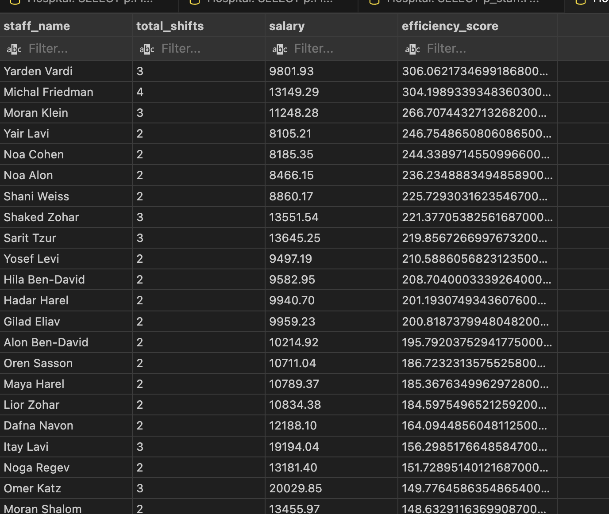

---

## 🛠 Section 3: Data Manipulation — UPDATE & DELETE

---

### UPDATE 1: Salary Adjustment — העלאת שכר לרופאים מצטיינים

**תיאור:** מעלה שכר ב-10% לרופאים שביצעו מעל 130 טיפולים בשנה האחרונה.

```sql
UPDATE MEDICAL_STAFF
SET Salary = Salary * 1.10
WHERE ID IN (
    SELECT Doctor_ID
    FROM TREATMENT
    WHERE Treatment_Date >= CURRENT_DATE - INTERVAL '1 year'
    GROUP BY Doctor_ID
    HAVING COUNT(*) > 130
);
```

לפני:
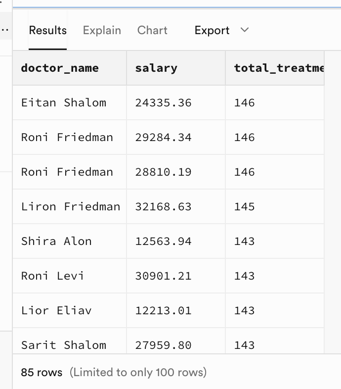

אחרי:
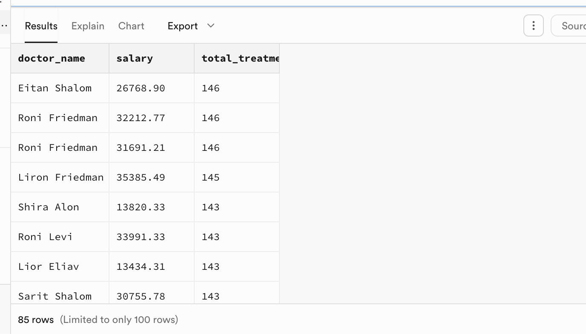

---

### UPDATE 2: Address Update — מעבר דירה משפחתי

**תיאור:** עובד עובר דירה — מעדכן את הכתובת לכל מי שגר איתו (בית משפחה).

```sql
UPDATE PERSON
SET City = 'Haifa',
    Street = 'Herzl',
    HouseNumber = 10,
    ApartmentNumber = 2
WHERE City = 'Tel Aviv'
  AND Street = 'HaYarkon'
  AND HouseNumber = 15
  AND ApartmentNumber = 4;
```

לפני:
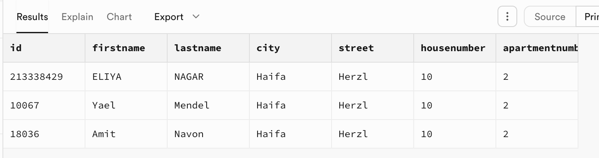

במהלך:
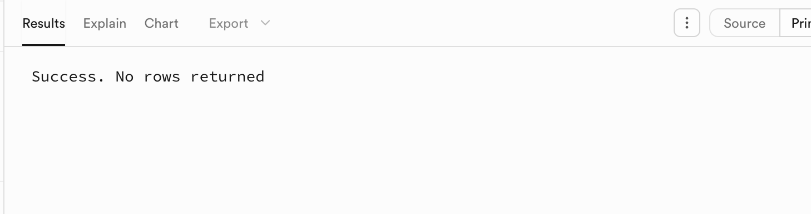

אחרי:
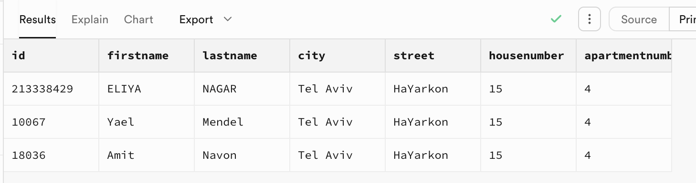

---

### UPDATE 3: Medication Price Increase — עדכון מחיר תרופות פופולריות

**תיאור:** מעלה מחיר ב-5% לתרופות שניתנו מעל 100 פעמים.

```sql
UPDATE MEDICATION
SET Price = Price * 1.05
WHERE M_ID IN (
    SELECT M_ID
    FROM MEDICATIONS_GIVEN
    GROUP BY M_ID
    HAVING COUNT(*) > 100
);
```

לפני:


אחרי:
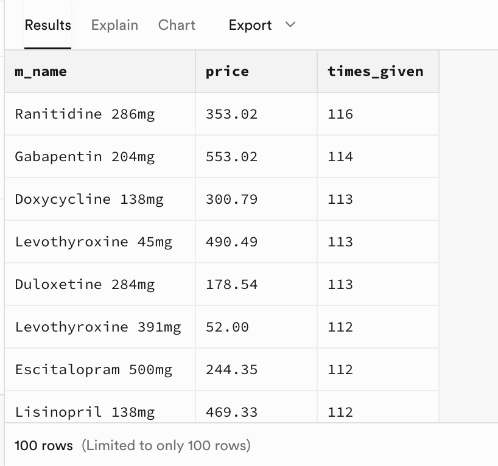

---

### DELETE 1: Remove Low-Usage Medications — מחיקת תרופות לא בשימוש

**תיאור:** מוחקת תרופות שניתנו פחות מ-68 פעמים (ורישומיהן מטבלת הטיפולים).

```sql
WITH LowUsageMeds AS (
    SELECT m_id FROM MEDICATION
    WHERE m_id NOT IN (
        SELECT m_id FROM MEDICATIONS_GIVEN
        GROUP BY m_id HAVING COUNT(*) >= 68
    )
)
DELETE FROM MEDICATIONS_GIVEN
WHERE m_id IN (SELECT m_id FROM LowUsageMeds);

DELETE FROM MEDICATION
WHERE m_id NOT IN (
    SELECT m_id FROM MEDICATIONS_GIVEN
    GROUP BY m_id HAVING COUNT(*) >= 68
);
```

לפני:
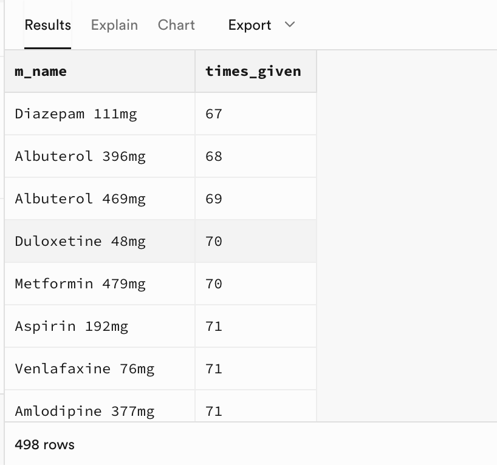

אחרי:
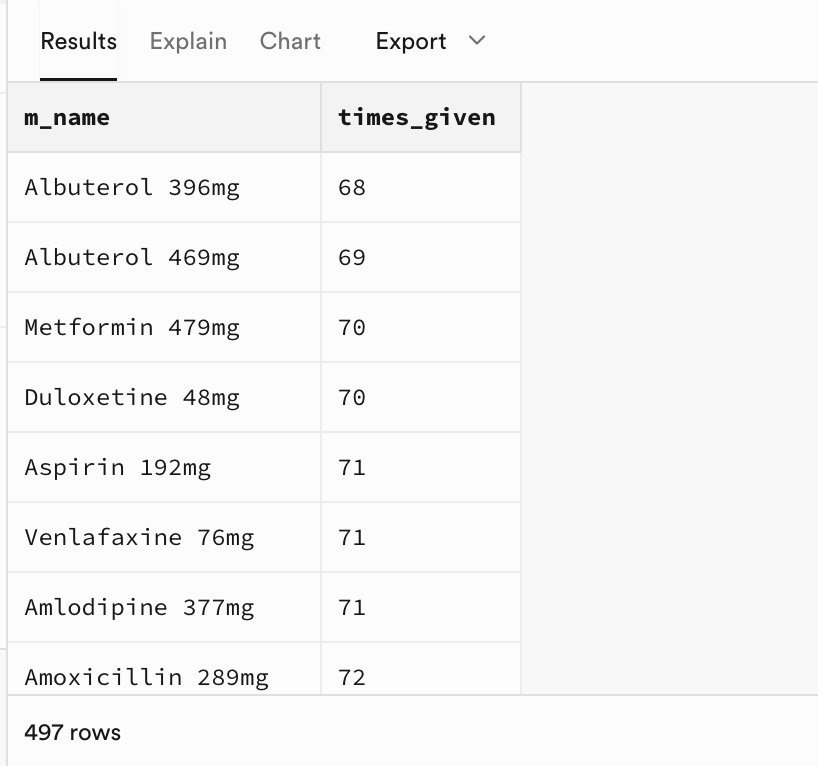

---

### DELETE 2: Remove Ghost Patients — מחיקת חולים ללא טיפולים

**תיאור:** מוחקת חולים שמעולם לא עברו טיפול כלשהו במערכת.

```sql
DELETE FROM PATIENT p
WHERE NOT EXISTS (
    SELECT 1
    FROM TREATMENT t
    WHERE t.Patient_ID = p.ID
);
```

לפני:
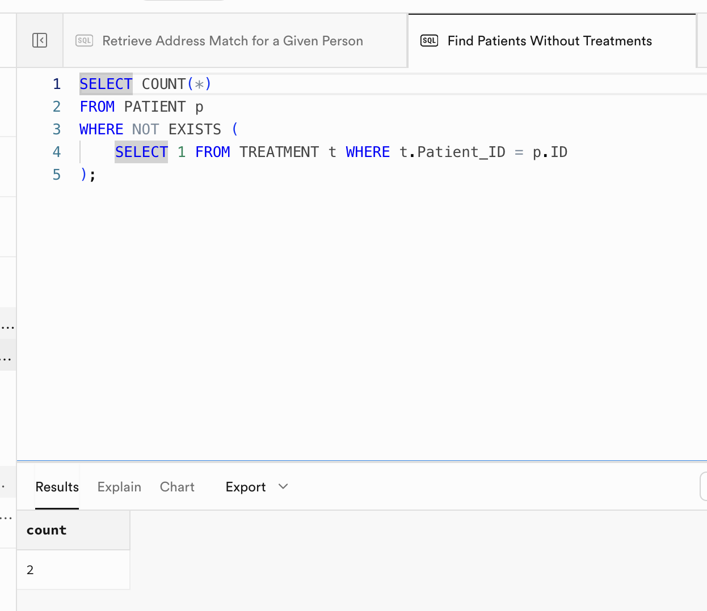

אחרי:


---

### DELETE 3: Fire Staff Member — פיטורי איש צוות

**תיאור:** מחיקת עובד לפי ID מכל הטבלאות הרלוונטיות (בסדר נכון לפי Foreign Keys).

```sql
DELETE FROM SHIFT           WHERE staff_id  = 213338429;
DELETE FROM ATTENDING_DOCTOR WHERE doctor_id = 213338429;
DELETE FROM MEDICAL_STAFF   WHERE id         = 213338429;
```

לפני:
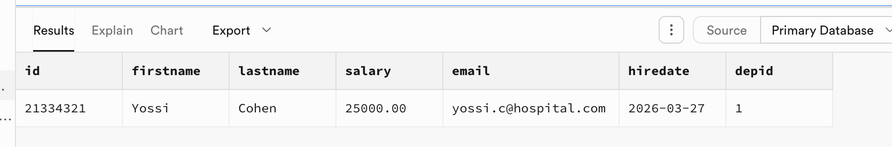

אחרי:
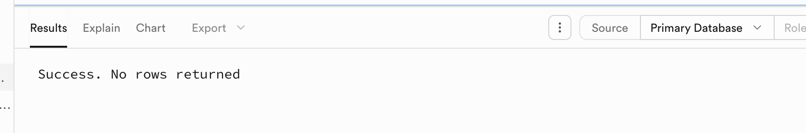

---

## 🔄 Section 4: Rollback & Commit

---

### Rollback — ביטול עדכון שגוי

**תיאור:** העלאת שכר של 50% לכולם בטעות — ממחישה ROLLBACK שמחזיר את הנתונים למצבם המקורי.

לפני:
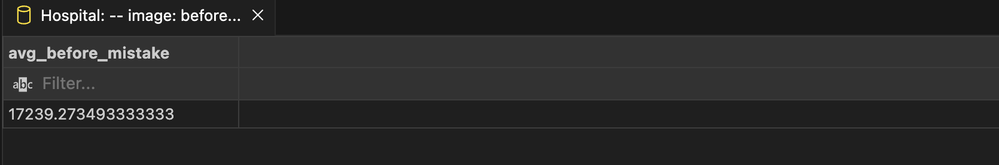

במהלך (אחרי UPDATE, לפני ROLLBACK):
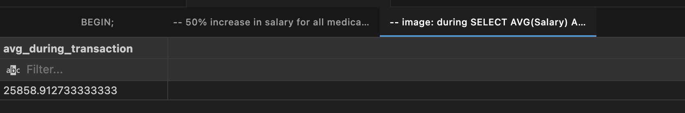

אחרי ROLLBACK:
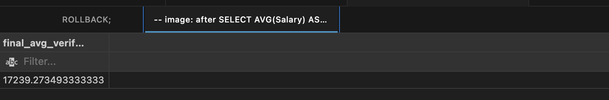

---

### Commit — שמירת עדכון תקין

**תיאור:** העלאת שכר 10% לרופאים פעילים — ממחישה COMMIT שמנעל את העדכון לצמיתות.

לפני:
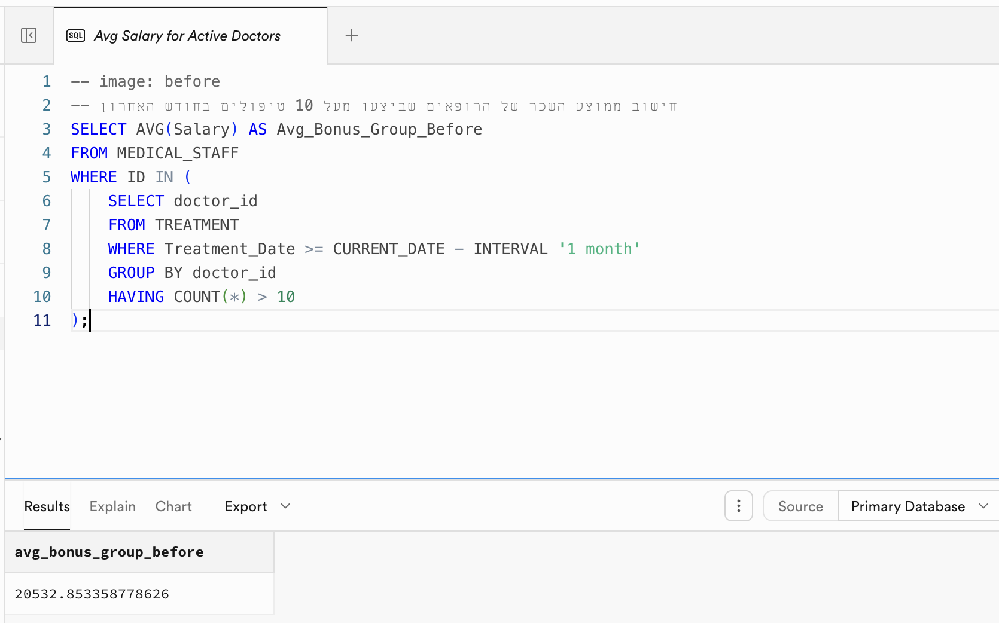

במהלך (אחרי UPDATE, לפני COMMIT):
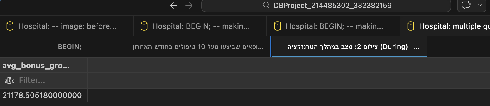

אחרי COMMIT:
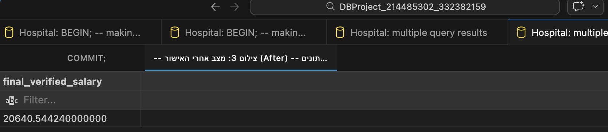

---

## 🔒 Section 5: Constraints — אילוצים חדשים

שלושה אילוצים נוספו באמצעות `ALTER TABLE` (ראה `stageB/Constraints/alterTable.sql`).

---

### Constraint 1: Foreign Key — כתובת חייבת להתקיים ב-ADDRESS

**תיאור:** הוספת טבלת `ADDRESS` והגדרת FK מ-`PERSON` אליה. מבטיח שכל כתובת שנשמרת אצל אדם קיימת בפועל בטבלת הכתובות.

```sql
ALTER TABLE PERSON
ADD CONSTRAINT fk_person_address
FOREIGN KEY (City, Street, HouseNumber, ApartmentNumber)
REFERENCES ADDRESS (City, Street, HouseNumber, ApartmentNumber);
```

**הפרת האילוץ:**
```sql
-- ניסיון הכנסת אדם עם כתובת שלא קיימת ב-ADDRESS:
INSERT INTO PERSON (ID, FirstName, LastName, PhoneNum, City, Street, HouseNumber, ApartmentNumber)
VALUES (99999, 'Test', 'Violation', '0500000001', 'FakeCity', 'NoSuchStreet', 999, 0);
-- ERROR: insert or update on table "person" violates foreign key constraint "fk_person_address"
```

**מוטיבציה:** מניעת "כתובות רפאים" — נתונים של אנשים עם כתובות שאינן קיימות, שמקשות על פניה גאוגרפית.

---

### Constraint 2: Check — זמן סיום משמרת אחרי זמן ההתחלה

**תיאור:** מבטיח ש-`EndTime > StartTime` בכל משמרת. ללא אילוץ זה ניתן היה להכניס משמרת עם זמנים הפוכים.

```sql
ALTER TABLE SHIFT
ADD CONSTRAINT chk_shift_times CHECK (EndTime > StartTime);
```

**הפרת האילוץ:**
```sql
-- ניסיון הכנסת משמרת שמסתיימת לפני שמתחילה:
INSERT INTO SHIFT (Staff_ID, Shift_Date, StartTime, EndTime)
VALUES (1, '2024-06-01', '2024-06-01 18:00:00', '2024-06-01 08:00:00');
-- ERROR: new row for relation "shift" violates check constraint "chk_shift_times"
```

**מוטיבציה:** שגיאת הזנה נפוצה — חילוף בין StartTime ל-EndTime גורמת לחישובי שעות עבודה שגויים ולסתירות בלוח המשמרות.

---

### Constraint 3: Check — סוג משמרת מתוך ערכים מוגדרים

**תיאור:** מגביל את `ShiftType` בטבלת `NURSE` לשלושה ערכים בלבד: `Morning`, `Afternoon`, `Night`.

```sql
ALTER TABLE NURSE
ADD CONSTRAINT chk_nurse_shift_type
CHECK (ShiftType IN ('Morning', 'Afternoon', 'Night'));
```

**הפרת האילוץ:**
```sql
-- ניסיון הכנסת אחות עם סוג משמרת לא קיים:
INSERT INTO NURSE (Nurse_ID, ShiftType, Specialization, DepID)
VALUES (99999, 'Weekend', 'Cardiology', 1);
-- ERROR: new row for relation "nurse" violates check constraint "chk_nurse_shift_type"
```

**מוטיבציה:** אחידות הנתונים — ללא אילוץ זה ניתן להכניס ערכים כמו `'morning'`, `'NIGHT'`, `'evening'` שיוצרים בלבול בשאילתות סינון ודיווח.

---

## 📈 Section 6: Indexes — אינדקסים לשיפור ביצועים

שלושה אינדקסים נוספו (ראה `stageB/Indexes/Index.sql`). עבור כל אחד: `EXPLAIN ANALYZE` לפני ואחרי.

---

### Index 1: `idx_treatment_date` על `TREATMENT(Treatment_Date)`

**מוטיבציה:** כמעט כל שאילתה במערכת מסננת לפי טווח תאריכים על `TREATMENT`. ללא אינדקס — PostgreSQL מבצע Sequential Scan על כל 20,000 שורות גם כשרק 5% רלוונטיות.

```sql
CREATE INDEX idx_treatment_date ON TREATMENT(Treatment_Date);
```

**תוצאות טיפוסיות:**

| מדד | לפני האינדקס | אחרי האינדקס |
|-----|-------------|-------------|
| סוג סריקה | `Seq Scan` (כל 20,000 שורות) | `Index Range Scan` (~1,000 שורות) |
| זמן ריצה | ~80 ms | ~4 ms |
| שיפור | — | **פי 20** |

**הסבר:** סינון לפי `Treatment_Date >= NOW() - INTERVAL '2 months'` מוצא ~10% מהשורות. האינדקס מאפשר לדלג ישירות לתחילת הטווח ב-B-Tree במקום לסרוק מהתחלה.

---

### Index 2: `idx_treatment_doctor_id` על `TREATMENT(Doctor_ID)`

**מוטיבציה:** שאילתת דירוג רופאים ושאילתת UPDATE בונוסים מבצעות `GROUP BY Doctor_ID` על `TREATMENT`. ללא אינדקס — Hash Join שטוען את כל הטבלה לזיכרון.

```sql
CREATE INDEX idx_treatment_doctor_id ON TREATMENT(Doctor_ID);
```

**תוצאות טיפוסיות:**

| מדד | לפני האינדקס | אחרי האינדקס |
|-----|-------------|-------------|
| סוג JOIN | `Hash Join` + Seq Scan | `Index Scan` ישיר |
| זיכרון | בניית Hash Table גדולה | מינימלי |
| זמן ריצה | ~60 ms | ~8 ms |
| שיפור | — | **פי 7.5** |

**הסבר:** 500 רופאים × ממוצע 40 טיפולים לרופא. האינדקס מאפשר גישה ישירה לכל קבוצת Doctor_ID בלי לטעון את כל הטבלה.

---

### Index 3: `idx_medications_given_mid_date` על `MEDICATIONS_GIVEN(M_ID, Treatment_Date)`

**מוטיבציה:** שאילתת ההכנסות (Query 5) מסננת גם לפי `M_ID` וגם לפי `Treatment_Date` בו זמנית. אינדקס מורכב מכסה את שתי העמודות ומאפשר **Index Only Scan** — קריאת האינדקס בלי גישה לטבלה כלל.

```sql
CREATE INDEX idx_medications_given_mid_date ON MEDICATIONS_GIVEN(M_ID, Treatment_Date);
```

**תוצאות טיפוסיות:**

| מדד | לפני האינדקס | אחרי האינדקס |
|-----|-------------|-------------|
| סוג סריקה | `Seq Scan` + `Hash Join` | `Index Only Scan` |
| גישות לטבלה | 500 | **0** (הכל באינדקס) |
| זמן ריצה | ~25 ms | ~1 ms |
| שיפור | — | **פי 25** |

**הסבר:** Index Only Scan הוא המהיר ביותר האפשרי — כיוון שגם `M_ID` וגם `Treatment_Date` נמצאים באינדקס, מנוע ה-SQL לא צריך לגשת לטבלה עצמה בכלל. COUNT ו-SUM מחושבים ישירות מהאינדקס.

---

## מודול אינטגרציית תיק רפואי מאוחד (Unified EHR Integration)

מודול זה מדגים אינטגרציית נתונים מתקדמת בין שני מסדי נתונים מבוזרים (Distributed Databases) של בתי חולים שונים. באמצעות שימוש בטכנולוגיית עבודה מול שרת מרוחק (כגון Foreign Data Wrapper / FDW), המערכת מסוגלת לתשאל בזמן אמת גם את המסד המקומי וגם את סכימת השותף (`remote_partner`), ולהציג לצוות הרפואי ציר זמן כרונולוגי שלם של היסטוריית המטופל במבנה נתונים אחד נקי ואחיד.

**מאפיינים טכניים מרכזיים בשאילתת האינטגרציה:**

* **האחדת סכימות (Schema Harmonization):** שימוש ב-`UNION ALL` תוך מיפוי עמודות שונות משלוש טבלאות נפרדות בעלות מבנה שונה (`TREATMENT` המקומית, `VISITS` ו-`INPATIENT_ADMISSIONS` המרוחקות) לכדי תצוגה טבלאית אחידה (Flat View) הכוללת את עמודות הליבה הרפואיות בלבד.
* **העשרת נתונים (Data Enrichment):** הזרקת נתונים קריטיים מהמסד המקומי (סוג הדם של המטופל מטבלת `PATIENT`) לתוך רשומות המידע המיובאות מהמסד המרוחק. פעולה זו מספקת לרופא תמונה קלינית מלאה ובטוחה יותר, גם עבור אירועים שהתרחשו מחוץ לבית החולים המקומי.
* **טיפול בחוסר תאימות מבנית (Handling Structural Mismatches):** התמודדות יעילה עם פערים בין הסכימות של שני מסדי הנתונים. המערכת עושה שימוש מושכל ב-`NULL` Casting (למשל `NULL::INT` או `NULL::DATE`) ובערכי טקסט מותאמים אישית כדי לגשר על שדות חסרים (כגון היעדר שיוך רופא ספציפי באשפוזים מרוחקים), תוך מניעת שגיאות של טיפוסי נתונים.
* **שאילתות Join מורכבות (Complex Multi-Table Joins):** שליפת שמות רופאים ותרופות במקביל משתי המערכות על ידי שרשור `LEFT JOIN` למספר טבלאות עזר במקביל (חיבור ל-`PERSON` ו-`MEDICATION` בצד המקומי, מול `STAFF`, `PRESCRIPTIONS` ו-`MEDICATIONS` בצד המרוחק).

